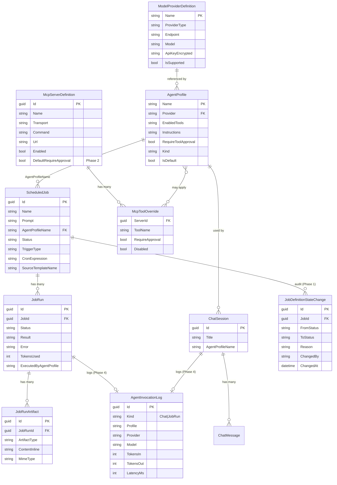
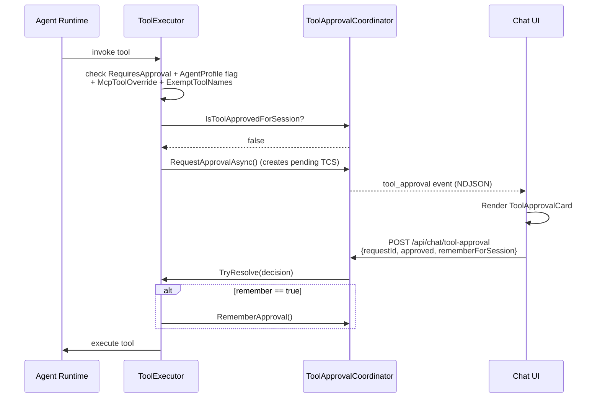
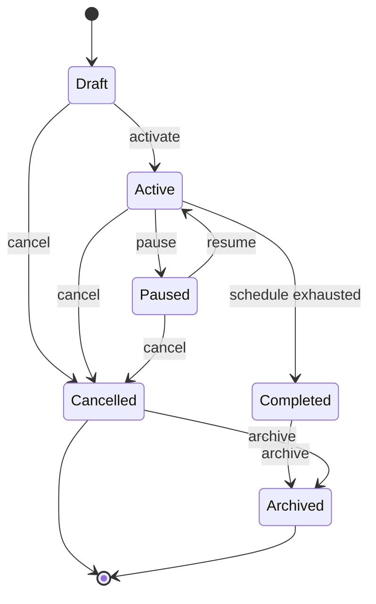
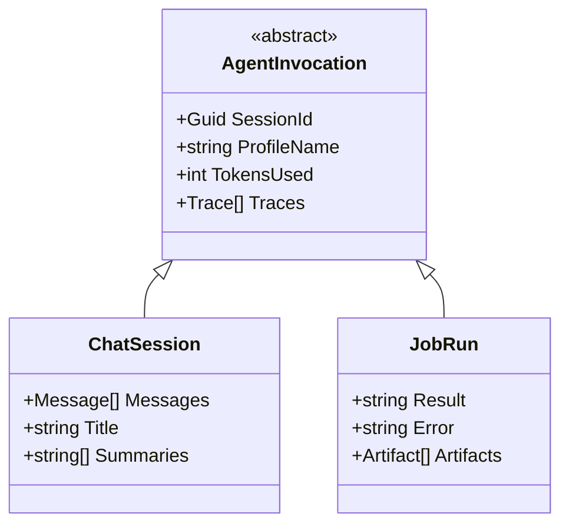

# OpenClawNet Concept Review — April 2026

**Author:** Mark (Lead Architect)  
**Requested by:** Bruno Capuano  
**Date:** 2026-04-25  
**Branch:** `docs/architecture-concept-review`  
**Status:** Review Document — recommendations adopted (see §4.5). Implementation tracked in same branch.

---

## 1. Executive Summary

OpenClawNet is a .NET 10 Aspire-orchestrated platform for running AI agents with scheduled jobs, interactive chat, and multi-channel output delivery. Users define **Model Providers** (LLM connections), configure **Agents** that use those providers and select available tools, create **Job Definitions** that bind agents to scheduled prompts, and observe results via **Channels** (a Slack-style output dashboard). The system currently supports internal tools (FileSystem, Shell, Web, Browser, Scheduler) and MCP (Model Context Protocol) tools from external servers. Tool execution can require user approval at runtime. Chat sessions provide interactive agent conversations, while Jobs enable unattended automation.

---

## 2. Conceptual Model — Walkthrough

### 2.1 Entity Relationship Diagram

```
┌─────────────────────────────────────────────────────────────────────────────┐
│                           OpenClawNet Domain Model                          │
├─────────────────────────────────────────────────────────────────────────────┤
│                                                                             │
│  ┌─────────────────────┐      references      ┌────────────────────────┐   │
│  │ ModelProviderDefn   │◄─────────────────────│    AgentProfile        │   │
│  │─────────────────────│                      │────────────────────────│   │
│  │ Name (PK)           │                      │ Name (PK)              │   │
│  │ ProviderType        │                      │ Provider (FK→ MPD.Name)│   │
│  │ Endpoint            │                      │ EnabledTools (CSV)     │   │
│  │ Model               │                      │ Instructions           │   │
│  │ ApiKey (encrypted)  │                      │ RequireToolApproval    │   │
│  │ IsSupported         │                      │ Kind (Standard/System) │   │
│  └─────────────────────┘                      │ IsDefault              │   │
│                                               └────────────┬───────────┘   │
│                                                            │               │
│  ┌─────────────────────┐                                   │ references    │
│  │ McpServerDefinition │                                   ▼               │
│  │─────────────────────│      ┌──────────────────────────────────────┐    │
│  │ Id (PK)             │      │         ScheduledJob (Job Defn)      │    │
│  │ Name                │      │──────────────────────────────────────│    │
│  │ Transport           │      │ Id (PK)                              │    │
│  │ Command / Url       │      │ Name                                 │    │
│  │ Enabled             │      │ Prompt                               │    │
│  │ IsBuiltIn           │      │ AgentProfileName (FK→ AP.Name)       │    │
│  └─────────┬───────────┘      │ Status (Draft/Active/Paused/...)     │    │
│            │                  │ TriggerType (Cron/Manual/Webhook)    │    │
│            │ has many         │ CronExpression                       │    │
│            ▼                  │ SourceTemplateName                   │    │
│  ┌─────────────────────┐      └─────────────────┬────────────────────┘    │
│  │ McpToolOverride     │                        │                         │
│  │─────────────────────│                        │ has many                │
│  │ ServerId (FK)       │                        ▼                         │
│  │ ToolName            │      ┌──────────────────────────────────────┐    │
│  │ RequireApproval     │      │              JobRun                  │    │
│  │ Disabled            │      │──────────────────────────────────────│    │
│  └─────────────────────┘      │ Id (PK)                              │    │
│                               │ JobId (FK→ SJ.Id)                    │    │
│                               │ Status (running/completed/failed)    │    │
│                               │ Result / Error                       │    │
│                               │ TokensUsed                           │    │
│                               │ ExecutedByAgentProfile               │    │
│                               └─────────────────┬────────────────────┘    │
│                                                 │                         │
│  ┌─────────────────────┐                        │ has many                │
│  │ Internal Tools      │                        ▼                         │
│  │─────────────────────│      ┌──────────────────────────────────────┐    │
│  │ ITool interface     │      │          JobRunArtifact              │    │
│  │ (scheduler, shell,  │      │──────────────────────────────────────│    │
│  │  web, filesystem,   │      │ Id (PK)                              │    │
│  │  browser, etc.)     │      │ JobRunId (FK)                        │    │
│  │ RequiresApproval    │      │ ArtifactType (Text/Markdown/JSON/..) │    │
│  └─────────────────────┘      │ ContentInline / ContentPath          │    │
│                               │ MimeType                             │    │
│                               └──────────────────────────────────────┘    │
│                                                                           │
│  ┌─────────────────────┐                                                  │
│  │    ChatSession      │ (Parallel structure — NOT JobRun today)         │
│  │─────────────────────│                                                  │
│  │ Id (PK)             │                                                  │
│  │ Title               │                                                  │
│  │ AgentProfileName    │                                                  │
│  │ Messages[]          │                                                  │
│  └─────────────────────┘                                                  │
│                                                                           │
└─────────────────────────────────────────────────────────────────────────────┘
```

#### Mermaid Rendering



---

### 2.2 Model Providers

**What it is:** A named configuration for connecting to an LLM backend. Defines the provider type (Ollama, Azure OpenAI, Foundry, Foundry Local, GitHub Copilot, LM Studio), endpoint URL, model/deployment name, and authentication credentials.

**What it owns / references:**  
- Self-contained configuration entity
- Referenced by `AgentProfile.Provider` (name-based FK)
- Multiple definitions can exist for the same provider type (e.g., "ollama-gemma" and "ollama-llama" both using "ollama" type)

**Current state:** ✅ Implemented  

**Where it lives:**  
- Entity: `src/OpenClawNet.Storage/Entities/ModelProviderDefinition.cs`
- API: `src/OpenClawNet.Gateway/Endpoints/ModelProviderEndpoints.cs`
- Store: `src/OpenClawNet.Storage/ModelProviderDefinitionStore.cs` (implicit via `IModelProviderDefinitionStore`)

---

### 2.3 MCP Tools (External)

**What it is:** Tools exposed via the Model Context Protocol (MCP) from external servers. An MCP server can be a local command-line process (Stdio transport), an HTTP endpoint, or an in-process server. Each server publishes a manifest of available tools with schemas.

**What it owns / references:**  
- `McpServerDefinitionEntity` — server configuration (transport, command, URL, env vars)
- `McpToolOverrideEntity` — per-tool overrides (RequireApproval, Disabled)
- Built-in servers are flagged `IsBuiltIn = true` and cannot be deleted

**Current state:** ✅ Implemented  

**Where it lives:**  
- Entities: `src/OpenClawNet.Storage/Entities/McpServerDefinitionEntity.cs`, `McpToolOverrideEntity.cs`
- API: `src/OpenClawNet.Gateway/Endpoints/McpServerEndpoints.cs`
- Runtime: `src/OpenClawNet.Mcp.Core/` (StdioMcpHost, HttpMcpHost, InProcessMcpHost)

---

### 2.4 Internal Tools

**What it is:** Native .NET tools that ship with OpenClawNet. These implement the `ITool` interface and are registered in the tool registry. Examples: `scheduler.schedule`, `filesystem.read`, `shell.execute`, `web.fetch`, `browser.browse`.

**What it owns / references:**  
- `ToolMetadata` record with Name, Description, ParameterSchema, RequiresApproval, Category, Tags
- Registered via `IToolRegistry` at startup
- Some tools (shell, browser, scheduler) have dedicated Aspire services

**Current state:** ✅ Implemented  

**Where it lives:**  
- Abstractions: `src/OpenClawNet.Tools.Abstractions/` (ITool, IToolRegistry, ToolMetadata)
- Core: `src/OpenClawNet.Tools.Core/` (ToolRegistry, ToolExecutor)
- Tool projects: `src/OpenClawNet.Tools.*/` (FileSystem, Shell, Web, Browser, Scheduler, etc.)

---

### 2.5 Agents (Agent Profiles)

**What it is:** A named agent configuration that binds an LLM (via model provider reference), instructions (system prompt), tool selection, and behavior flags. Agents are the personality/persona layer on top of raw model access.

**What it owns / references:**  
- `Provider` (FK → ModelProviderDefinition.Name)
- `EnabledTools` (CSV of storage-form tool names, e.g., "scheduler.schedule, filesystem.read")
- `Instructions` (system prompt text)
- `RequireToolApproval` (boolean, default true)
- `Kind` (Standard, System, ToolTester)

**Current state:** ✅ Implemented  

**Where it lives:**  
- Abstraction: `src/OpenClawNet.Models.Abstractions/AgentProfile.cs`
- Entity: `src/OpenClawNet.Storage/Entities/AgentProfileEntity.cs`
- API: `src/OpenClawNet.Gateway/Endpoints/AgentProfileEndpoints.cs`

---

### 2.6 Job Definitions (ScheduledJob)

**What it is:** A unit of scheduled agent work. Defines the prompt (instruction), which agent to use, how/when to trigger (cron, one-shot, manual, webhook), and lifecycle state.

**What it owns / references:**  
- `AgentProfileName` (FK → AgentProfile.Name)
- `Runs` (List<JobRun>)
- `TriggerType` enum (Manual, Cron, OneShot, Webhook)
- `Status` enum (Draft, Active, Paused, Cancelled, Completed)
- `SourceTemplateName` (traceability for demo template lineage)

**Current state:** ✅ Implemented  

**Where it lives:**  
- Entity: `src/OpenClawNet.Storage/Entities/ScheduledJob.cs`
- Enums: `src/OpenClawNet.Storage/Entities/JobStatus.cs`, `TriggerType.cs`
- Transitions: `src/OpenClawNet.Storage/Entities/JobStatusTransitions.cs`
- API: `src/OpenClawNet.Gateway/Endpoints/JobEndpoints.cs`
- Scheduler: `src/OpenClawNet.Services.Scheduler/`

---

### 2.7 Job Runs

**What it is:** A single execution of a Job Definition. Captures start/end time, success/failure status, result/error, tokens consumed, and which agent profile was used.

**What it owns / references:**  
- `JobId` (FK → ScheduledJob.Id)
- `Artifacts` (via JobRunArtifact)
- `Status` (string: "running", "completed", "failed")
- `ExecutedByAgentProfile` (audit trail)
- `InputSnapshotJson` (immutable input at execution time)

**Current state:** ✅ Implemented  

**Where it lives:**  
- Entity: `src/OpenClawNet.Storage/Entities/JobRun.cs`
- Artifacts: `src/OpenClawNet.Storage/Entities/JobRunArtifact.cs`

---

### 2.8 Channels

**What it is:** A Slack-style output dashboard that surfaces job outputs (artifacts) in a chronological stream. Each "channel" corresponds to a Job Definition — the channel shows all historical artifacts from all runs of that job.

**What it owns / references:**  
- Conceptually wraps JobDefinition + all its JobRunArtifacts
- No separate "Channel" entity — channel is a view over existing data
- Future: `IChannelDeliveryAdapter` for Teams/Slack/Telegram/Discord push

**Current state:** ✅ Implemented  

**Where it lives:**  
- UI: `src/OpenClawNet.Channels/Components/Pages/ChannelsList.razor`, `ChannelDetail.razor`
- API: `src/OpenClawNet.Gateway/Endpoints/ChannelsApiEndpoints.cs`
- DTOs: `ChannelSummaryDto`, `ChannelDetailDto`, `ChannelDetailViewDto`

---

## 3. Validate Bruno's Mental Model

### Statement 1: "We have a collection of available LLMs models in the Model Provider section"

✅ **Yes, exactly right.** `ModelProviderDefinition` entities store named LLM configurations. Multiple definitions can exist for the same provider type (e.g., "ollama-gemma", "ollama-phi", "azure-gpt4o"). The UI exposes these via `/settings/providers` and the API at `GET /api/model-providers`.

---

### Statement 2: "We have a collection of MCP tools"

✅ **Yes, exactly right.** MCP servers are stored in `McpServerDefinitionEntity`. Each server can expose multiple tools (discovered at runtime via MCP protocol). Tools can be individually overridden via `McpToolOverrideEntity` (disable, require approval). Managed via `/settings/mcp` UI and `GET/POST/PUT/DELETE /api/mcp/servers`.

---

### Statement 3: "We have a collection of internal tools"

✅ **Yes, exactly right.** Internal tools implement `ITool` and are registered in `IToolRegistry`. Current tools: FileSystem, Shell, Web, Browser, Scheduler, Calculator, Text2Image, TextToSpeech, ImageEdit, YouTube, HtmlQuery, MarkItDown, GitHub, Embeddings. Listed via `GET /api/tools` and `/tools` UI page.

---

### Statement 4: "Each agent will use a model provider, and can choose which tools may use"

✅ **Yes, exactly right.** `AgentProfile.Provider` references a `ModelProviderDefinition.Name`. `AgentProfile.EnabledTools` contains a CSV of storage-form tool names (e.g., "scheduler.schedule, filesystem.read"). When `EnabledTools` is null/empty, all tools are available (back-compat default).

---

### Statement 5: "Each agent can also choose which MCP tools will be used"

✅ **Yes, exactly right.** The `EnabledTools` CSV includes both internal tools (prefixed with category, e.g., "scheduler.schedule") and MCP tools (prefixed with server slug, e.g., "filesystem.read_file"). The `/api/mcp/tools/available` endpoint returns all tools grouped by server for the UI picker.

---

### Statement 6: "Note: explain how the tool approval system works here?"

🟡 **Partially implemented — current flow documented below (Section 4a).**

---

### Statement 7: "We have a collection of job definitions"

✅ **Yes, exactly right.** `ScheduledJob` entity. Managed via `/jobs` UI and `GET/POST/PUT/DELETE /api/jobs`.

---

### Statement 8: "Each job is a prompt action that will use an Agent, and will run in different modes: run-once, scheduled, webhook"

✅ **Yes, exactly right.** `TriggerType` enum covers: `Manual` (user clicks Run), `Cron` (recurring schedule), `OneShot` (single scheduled datetime), `Webhook` (external trigger). The `Prompt` field contains the agent instruction. `AgentProfileName` specifies which agent to use.

---

### Statement 9: "Question: Is the job definition supposed to have a state active, disabled, cancelled, deprecated?"

🟡 **Partially matches current implementation.** Current states are `Draft | Active | Paused | Cancelled | Completed`. There's no `Disabled` or `Deprecated` — see Section 4b for analysis and recommendation.

---

### Statement 10: "Should we also keep an history of the job definition state change logs?"

❌ **Not implemented today.** No audit log for JobDefinition state transitions. Recommendation in Section 4b.

---

### Statement 11: "We have a collection of job runs, that represents the total execution of a job run"

✅ **Yes, exactly right.** `JobRun` entity with Status (running/completed/failed), Result, Error, TokensUsed, timestamps.

---

### Statement 12: "Note: how the chat feature applies here? Can be considered a job run?"

❌ **Not currently.** Chat sessions (`ChatSession`) and Job runs (`JobRun`) are separate, unrelated entities today. See Section 4c for analysis of three options.

---

### Statement 13: "Each job definition is also considered a channel, so in the channel website we can browse and see the jobs history and more details"

✅ **Yes, exactly right.** The Channels website (`/channels`) lists all jobs that have produced artifacts. Clicking a channel (`/channels/{jobId}`) shows all artifacts from all runs of that job in chronological order. "Channel = Job Definition's output stream" is the current mental model, and it's implemented.

---

## 4. Open Questions — Bruno's Direct Questions

### 4a. Tool Approval System

#### Current State: ✅ Implemented (3-tier model)

The tool approval system is **already implemented** with a design similar to Claude Code / Copilot CLI / Cursor:

**Architecture:**
1. **Tool-level declaration:** Each `ToolMetadata` has `RequiresApproval` boolean
2. **Agent-level default:** `AgentProfile.RequireToolApproval` (default: true)
3. **MCP tool override:** `McpToolOverrideEntity.RequireApproval` (null = inherit, true/false = override)
4. **Session memory:** `IToolApprovalCoordinator.RememberApproval()` — "remember for this session"
5. **Exempt list:** `ToolApprovalExemptions.ExemptToolNames` — tools that bypass approval (currently: "schedule")

**Runtime Flow (Sequence Diagram):**

```
┌─────────┐    ┌─────────────┐    ┌───────────────────────┐    ┌──────────────┐
│  Agent  │    │ToolExecutor │    │ToolApprovalCoordinator│    │  Chat UI     │
│ Runtime │    │             │    │                       │    │              │
└────┬────┘    └──────┬──────┘    └───────────┬───────────┘    └──────┬───────┘
     │                │                        │                       │
     │ invoke tool    │                        │                       │
     │───────────────►│                        │                       │
     │                │                        │                       │
     │                │ check RequiresApproval │                       │
     │                │ + AgentProfile flag    │                       │
     │                │ + McpToolOverride      │                       │
     │                │ + ExemptToolNames      │                       │
     │                │                        │                       │
     │                │ IsToolApprovedForSession?                      │
     │                │───────────────────────►│                       │
     │                │                        │                       │
     │                │◄── false ──────────────│                       │
     │                │                        │                       │
     │                │ RequestApprovalAsync() │                       │
     │                │───────────────────────►│ (creates pending TCS) │
     │                │                        │                       │
     │◄─ tool_approval event (NDJSON) ─────────│                       │
     │                │                        │                       │
     │                │                        │    ToolApprovalCard   │
     │                │                        │◄──────────────────────│
     │                │                        │    (Approve/Deny)     │
     │                │                        │                       │
     │                │                        │    POST /api/chat/    │
     │                │                        │    tool-approval      │
     │                │                        │◄──────────────────────│
     │                │                        │    {requestId,        │
     │                │                        │     approved: true,   │
     │                │                        │     rememberForSession}│
     │                │                        │                       │
     │                │ TryResolve(decision)   │                       │
     │                │◄──────────────────────│                       │
     │                │                        │                       │
     │                │ if remember:           │                       │
     │                │  RememberApproval()    │                       │
     │                │───────────────────────►│                       │
     │                │                        │                       │
     │                │ execute tool           │                       │
     │◄──────────────│                        │                       │
```

#### Mermaid Rendering



**Key Files:**
- `src/OpenClawNet.Agent/ToolApproval/IToolApprovalCoordinator.cs` — interface
- `src/OpenClawNet.Agent/ToolApproval/ToolApprovalCoordinator.cs` — singleton in-memory impl
- `src/OpenClawNet.Agent/ToolApproval/ToolApprovalExemptions.cs` — exempt tool list
- `src/OpenClawNet.Agent/ToolApproval/ApprovalDecision.cs` — decision record
- `src/OpenClawNet.Gateway/Endpoints/ToolApprovalEndpoints.cs` — HTTP POST handler
- `src/OpenClawNet.Web/Components/ToolApprovalCard.razor` — UI component

**Security Implications:**

| Concern | Current Mitigation | Gap / Recommendation |
|---------|-------------------|----------------------|
| Prompt injection via tool output | ✅ **DefaultToolResultSanitizer** — Multi-layer defense: (1) Unicode NFC normalization prevents homoglyph attacks, (2) Control char stripping, (3) Max line-length enforcement prevents pathological inputs, (4) HTML escaping neutralizes injection tags, (5) Prompt-injection marker detection and wrapping (e.g., "ignore previous", "system:", "assistant:"), (6) Content truncation at 64KB configurable limit, (7) Tool-output block wrapping prevents context breakout. Implemented in `DefaultToolResultSanitizer.cs`, validated by security-focused unit tests. | ✅ Implemented (Feature 2, Story 2 & 6) |
| Auto-approval for unattended jobs | `AgentProfile.RequireToolApproval = false` disables | ✅ Explicitly opt-in per profile |
| Audit trail | ✅ **ToolApprovalLog** entity captures every approval decision (requestId, toolName, approved, source=User/Timeout/SessionMemory, timestamp, sessionId). Written by `ToolApprovalCoordinator` on every approve/deny/timeout. | ✅ Implemented (Feature 2, Story 1 & 5) |
| Session memory persistence | In-memory only (lost on restart) | 🟡 Consider DB persistence for multi-session "always allow" |
| MCP tool sandboxing | None (tools run with app permissions) | 🔒 **Critical gap** — MCP servers can execute arbitrary code |

---

### 4b. Job Definition State Machine

#### Current State

Current enum:
```csharp
public enum JobStatus
{
    Draft = 0,      // Not yet activated. Editable.
    Active = 1,     // Scheduler will poll and execute.
    Paused = 2,     // Temporarily suspended. Resumable.
    Cancelled = 3,  // Permanently stopped by user. Terminal.
    Completed = 4   // Schedule exhausted. Terminal.
}
```

Current transitions (from `JobStatusTransitions.cs`):
```
Draft → Active, Cancelled
Active → Paused, Cancelled, Completed
Paused → Active, Cancelled
```

#### Analysis

**Bruno's Question:** Should there be `Active | Disabled | Cancelled | Deprecated`?

| Bruno's Term | Current Equivalent | Notes |
|--------------|-------------------|-------|
| Active | `Active` | ✅ Exists |
| Disabled | `Paused` | ✅ Exists (paused is effectively "disabled but resumable") |
| Cancelled | `Cancelled` | ✅ Exists |
| Deprecated | None | 🟡 Semantic question — see below |

**Recommendation: Keep current states, add `Archived`**

The current 5-state model is well-designed:
- `Draft` — configuration phase, not schedulable
- `Active` — live, scheduler polls
- `Paused` — suspended (what Bruno called "disabled"), resumable
- `Cancelled` — user stopped, terminal
- `Completed` — schedule exhausted, terminal

**Missing: `Archived`** — for old jobs you want to hide from lists but preserve for audit. Archived jobs should not appear in default views but remain queryable.

**Proposed State Diagram:**

```
                    ┌─────────────────────────────────────┐
                    │                                     │
        ┌───────────▼────────────┐                       │
        │        Draft           │                       │
        │  (editable, not polled)│                       │
        └───────────┬────────────┘                       │
                    │                                    │
          ┌─────────▼─────────┐                         │
          │      Active       │◄────────────────┐       │
          │  (scheduler polls)│                 │       │
          └─────┬───────┬─────┘                 │       │
                │       │                       │       │
       ┌────────┘       └────────┐              │       │
       ▼                         ▼              │       │
┌──────────────┐          ┌───────────┐         │       │
│   Paused     │          │ Completed │         │       │
│(suspended,   │──resume─►│ (terminal)│─archive─┼───┐   │
│ resumable)   │          └───────────┘         │   │   │
└──────┬───────┘                                │   │   │
       │                                        │   │   │
       └──────────────cancel────────────────────┘   │   │
                                                    ▼   │
                           ┌───────────────┐        │   │
                           │   Cancelled   │◄───────┘   │
                           │   (terminal)  │            │
                           └───────┬───────┘            │
                                   │                    │
                                   └──────archive───────┤
                                                        ▼
                                               ┌────────────────┐
                                               │    Archived    │
                                               │(hidden, audit) │
                                               └────────────────┘
```

#### Mermaid Rendering



**New Transitions:**
- `Completed → Archived` (cleanup)
- `Cancelled → Archived` (cleanup)

#### Audit Log Recommendation: YES

**Proposed Entity:**

```csharp
public sealed class JobDefinitionStateChange
{
    public Guid Id { get; set; } = Guid.NewGuid();
    public Guid JobId { get; set; }  // FK → ScheduledJob.Id
    public JobStatus FromStatus { get; set; }
    public JobStatus ToStatus { get; set; }
    public string? Reason { get; set; }  // Optional user-provided reason
    public string? ChangedBy { get; set; }  // User/system identifier
    public DateTime ChangedAt { get; set; } = DateTime.UtcNow;
    
    public ScheduledJob Job { get; set; } = null!;
}
```

**Why it matters:**
- Compliance/audit: know who changed what and when
- Debugging: understand job lifecycle issues
- Demo storytelling: show governance features

**Effort:** S (entity + migration + write on state change)

#### Demo Templates as State?

**Question:** Should "demo template" jobs be a separate state, or just a flag?

**Recommendation: Keep as flag (`SourceTemplateName`), not state**

The current design (`SourceTemplateName` column) is correct:
- Demo templates are identified by `SourceTemplateName` (e.g., "doc-pipeline", "website-watcher")
- A job can have any lifecycle state AND be a template instance
- Multiple instances of the same template coexist (unlimited, per PR #64 decision)
- Flag-based approach avoids state machine complexity

---

### 4c. Chat as Job Run?

**Bruno's Question:** How does the chat feature apply here? Can it be considered a job run?

#### Current State

Chat and Jobs are **completely separate**:

| Aspect | Chat | Jobs |
|--------|------|------|
| Entity | `ChatSession` | `ScheduledJob` + `JobRun` |
| Trigger | User message | Schedule / Manual / Webhook |
| Lifecycle | Open-ended conversation | Single execution |
| UI | `/chat` | `/jobs`, `/channels` |
| Output | Messages in session | Artifacts in run |
| History | Messages list | JobRun records |

#### Three Options Analyzed

**Option A: Chat IS a JobRun**

Every chat session creates an ephemeral `JobDefinition` + `JobRun` pair.

```
ChatSession.SendMessage() →
  Create JobDefinition (name="Interactive Chat", trigger=Manual)
  Create JobRun
  Execute
  Store result as JobRunArtifact
```

| Pros | Cons |
|------|------|
| Unified history (all agent work in one place) | Definition explosion (thousands of ephemeral defs) |
| Channels surface chats | Schema awkwardness (chat sessions ≠ jobs conceptually) |
| Single observability model | UX confusion (why is my chat a "job"?) |
| | Breaking change to existing ChatSession data |

**Option B: Chat is a SIBLING of JobRun (Recommended ⭐)**

Both `ChatSession` and `JobRun` are subtypes of a shared `AgentInvocation` concept. They share infrastructure (logs, tokens, traces) but have different lifecycles.

```
                    ┌──────────────────┐
                    │  AgentInvocation │ (abstract concept, not an entity)
                    │  - SessionId     │
                    │  - ProfileName   │
                    │  - TokensUsed    │
                    │  - Traces        │
                    └────────┬─────────┘
                             │
               ┌─────────────┴─────────────┐
               │                           │
       ┌───────▼───────┐           ┌───────▼───────┐
       │  ChatSession  │           │    JobRun     │
       │  - Messages[] │           │  - Result     │
       │  - Title      │           │  - Error      │
       │  - Summaries  │           │  - Artifacts  │
       └───────────────┘           └───────────────┘
```

#### Mermaid Rendering



| Pros | Cons |
|------|------|
| Clean conceptual model | Some plumbing duplication |
| Doesn't pollute JobDefinition | Two code paths for observability |
| Natural lifecycle difference | Chat artifacts not in channels by default |
| No breaking changes | |

**Option C: Chat is a special mode of Job**

`TriggerType` adds `Interactive` alongside `Manual | Cron | OneShot | Webhook`. JobDefinition for chat is implicitly created per-user or per-conversation.

```csharp
public enum TriggerType
{
    Manual = 0,
    Cron = 1,
    OneShot = 2,
    Webhook = 3,
    Interactive = 4  // NEW
}
```

| Pros | Cons |
|------|------|
| Single job model | Stretches "job" concept beyond original intent |
| Channels automatically include chats | JobDefinition per conversation is awkward |
| Unified API | Interactive jobs don't have prompts (user provides) |

#### Recommendation: Option B (Sibling Model)

**Rationale:**

1. **Conceptual clarity:** Jobs are "scheduled automation" and chat is "interactive conversation." Forcing chat into the job model creates semantic confusion.

2. **Current codebase alignment:** `ChatSession` and `JobRun` are already separate entities with different relationships. Option B preserves this while adding a shared abstraction.

3. **Channels opt-in:** If users want chat outputs in channels, add `ChatSessionArtifact` entity that parallels `JobRunArtifact`, and wire into channels via a union query. This is additive, not breaking.

4. **Minimal refactoring:** Option A and C require schema changes to core entities. Option B is purely additive.

**Implementation Path:**
- Add `AgentInvocationLog` entity (shared telemetry: session_id, profile, tokens, latency)
- Both `ChatSession` and `JobRun` reference `AgentInvocationLog`
- Channels can optionally include chat artifacts via feature flag

---

### 4.5 Recommendations Adopted (Implementation Plan)

The recommendations from §4a, §4b, and §4c are **adopted in full** and being implemented on this branch (`docs/architecture-concept-review`). Phase tracking lives in `plan.md` in the session workspace.

#### Adopted from §4a — Tool Approval

- ✅ **Approval decision audit log** → new `ToolApprovalLog` entity, written by `ToolApprovalCoordinator` on every approve/deny/timeout. (Phase 1 + 2)
- ✅ **Prompt-injection sanitization for tool results** → new `IToolResultSanitizer` + default impl, wired into `ToolExecutor` between tool result and LLM context injection. (Phase 2)
- ✅ **Server-level default `RequireApproval`** → new `McpServerDefinition.DefaultRequireApproval` (nullable). Precedence: tool override > server default > agent profile default > tool metadata. (Phase 2)
- 🟡 **MCP process sandboxing** → scaffold only in this PR (`IMcpProcessIsolationPolicy` + `WorkingDirIsolationPolicy` behind config flag); full sandboxing deferred to a follow-up. (Phase 2)
- ✅ **Approval prompt timeout** → configurable seconds, auto-deny on expiry, countdown via NDJSON `expiresAt`. (Phase 2)

#### Adopted from §4b — Job Definition State Machine

- ✅ **`JobStatus.Archived`** added with transitions `Completed → Archived` and `Cancelled → Archived`. (Phase 1)
- ✅ **`JobDefinitionStateChange` audit entity** with FromStatus/ToStatus/Reason/ChangedBy/ChangedAt; written on every transition. (Phase 1 + 3)
- ✅ **UI: hide archived by default** with toggle to reveal. State-change history table on job detail page. Toast/badge on transition. (Phase 3)
- ✅ **Demo-template `SourceTemplateName` stays a flag**, not a state. New `Create & Activate` button creates jobs in `Active` state in one click. (Phase 3)

#### Adopted from §4c — Chat as Job Run (Option B: Sibling)

- ✅ **`AgentInvocationLog` entity** for shared telemetry across `ChatSession` and `JobRun` (kind, profile, provider, model, tokensIn/Out, latencyMs). (Phase 1 + 4)
- ✅ **`ChatSessionArtifact` entity** mirrors `JobRunArtifact`. (Phase 1)
- ✅ **Channels include chat artifacts** behind a feature flag (default off). Chat ↔ job-run cross-navigation in UI. (Phase 4)
- ❌ **Not adopted:** Option A (chat-as-jobrun unification) and Option C (Interactive trigger type). Both rejected per §4c rationale.

---

## 5. Improvement Opportunities

### 🔒 Security

| What | Why it matters | Effort |
|------|----------------|--------|
| **MCP tool sandboxing** — Run MCP servers in isolated processes with resource limits | MCP tools can execute arbitrary code; current design trusts all MCP servers | L |
| **Prompt injection mitigation** — Sanitize tool results before injecting into LLM context | Malicious tool output could hijack agent behavior | M |
| **Secret handling for provider creds** — Move API keys to ISecretStore, never log | `ModelProviderDefinition.ApiKey` stored plaintext in SQLite | M |
| **Tool approval audit persistence** — Log approval decisions to DB | No audit trail for "who approved what" | S |
| **Default RequireToolApproval per MCP server** — Server-level default, tool-level override | Currently tool-level only; tedious for multi-tool servers | S |

### ✨ UX

| What | Why it matters | Effort |
|------|----------------|--------|
| **Demo template flow polish** — "Create & Activate" single button | Current flow: create → manual activate is confusing | S |
| **Channel browsing from job detail** — "View in Channel" deep link | Users can't easily navigate from `/jobs/{id}` to `/channels/{id}` | S |
| **Chat ↔ job-run navigation** — If sibling model adopted, cross-link | Users expect unified history | M |
| **State-change visibility** — Toast/badge when job transitions | State changes are silent today | S |
| **Approval prompt timeout** — Show countdown, auto-deny after N seconds | Stuck approvals block indefinitely | M |

### 🎤 Demo Storytelling

| What | Why it matters | Effort |
|------|----------------|--------|
| **End-to-end flow demo script** — "Create agent → bind tools → define job → run → view in channel → branch into chat" | This flow showcases all pillars; needs friction points documented | S (doc only) |
| **Tool approval demo moment** — Trigger a dangerous tool, show approval card, explain policy | Approval system is impressive but easy to miss | S (doc only) |
| **Multi-provider switch demo** — Show same prompt on Ollama vs Azure vs Foundry | Model provider abstraction is a key differentiator | S |
| **Channel real-time demo** — Show artifact appearing as job runs | SignalR not yet implemented; polling lag visible | M (Phase 1.2) |

### 🧪 Tests

| What | Why it matters | Effort |
|------|----------------|--------|
| **State machine transition tests** — All valid/invalid transitions covered | `JobStatusTransitions` has edge cases | S |
| **Tool approval coordinator tests** — RequestApprovalAsync, TryResolve, RememberApproval | Critical path, minimal coverage today | M |
| **Chat-as-sibling tests** — If Option B adopted, shared telemetry logging | New code path needs coverage | M |
| **Audit log integrity tests** — `JobDefinitionStateChange` if adopted | Audit data must be correct | S |
| **MCP tool override tests** — Server default + tool override + agent override interaction | Complex precedence rules | M |

### 📚 Docs

| What | Why it matters | Effort |
|------|----------------|--------|
| **Glossary page** — Define: Agent, Profile, Job, Run, Channel, Tool, MCP Server | Terms are overloaded; newcomers confused | S |
| **Tool approval sequence diagram** — In architecture docs | Current flow undocumented outside code | S |
| **Job state machine diagram** — Visual with transitions | Existing `jobs.md` has text, no diagram | S |
| **Channels concept explainer** — "Channel = Job's output stream" | Users expect Slack-style channels | S |

---

## 6. Recommended Next Sprint (5–7 Issues)

Prioritized list derived from Sections 4 and 5:

1. **`JobDefinitionStateChange` audit log entity**  
   Add entity + migration + write-on-state-change. Enables governance features and debugging. (Section 4b)

2. **Tool approval audit logging**  
   Persist approval decisions (requestId, toolName, approved, timestamp, sessionId) to `ToolApprovalLog` entity. (Section 4a, Security)

3. **`Archived` job status**  
   Add to `JobStatus` enum, update `JobStatusTransitions`, add UI filter to hide archived by default. (Section 4b)

4. **Demo template "Create & Activate" button**  
   Single action to create job in Active state. Reduces demo friction. (UX)

5. **Channel deep-link from Job Detail**  
   Add "View in Channel →" button on `/jobs/{id}` that navigates to `/channels/{id}`. (UX)

6. **Prompt injection sanitization for tool results**  
   Add `IToolResultSanitizer` interface, implement basic HTML/script escaping, wire into `ToolExecutor`. (Security)

7. **Architecture glossary page**  
   Create `docs/architecture/glossary.md` defining all key terms. (Docs)

---

## Appendix: Key File References

| Concept | Primary Files |
|---------|--------------|
| Model Provider | `src/OpenClawNet.Storage/Entities/ModelProviderDefinition.cs`, `src/OpenClawNet.Gateway/Endpoints/ModelProviderEndpoints.cs` |
| MCP Server | `src/OpenClawNet.Storage/Entities/McpServerDefinitionEntity.cs`, `src/OpenClawNet.Gateway/Endpoints/McpServerEndpoints.cs` |
| Internal Tools | `src/OpenClawNet.Tools.Abstractions/`, `src/OpenClawNet.Tools.Core/` |
| Agent Profile | `src/OpenClawNet.Models.Abstractions/AgentProfile.cs`, `src/OpenClawNet.Storage/Entities/AgentProfileEntity.cs` |
| Job Definition | `src/OpenClawNet.Storage/Entities/ScheduledJob.cs`, `src/OpenClawNet.Gateway/Endpoints/JobEndpoints.cs` |
| Job Run | `src/OpenClawNet.Storage/Entities/JobRun.cs`, `src/OpenClawNet.Storage/Entities/JobRunArtifact.cs` |
| Channels | `src/OpenClawNet.Channels/`, `src/OpenClawNet.Gateway/Endpoints/ChannelsApiEndpoints.cs` |
| Tool Approval | `src/OpenClawNet.Agent/ToolApproval/`, `src/OpenClawNet.Gateway/Endpoints/ToolApprovalEndpoints.cs` |
| Chat Session | `src/OpenClawNet.Storage/Entities/ChatSession.cs`, `src/OpenClawNet.Web/Components/Pages/Chat.razor` |

---

*Document generated by Mark (Lead Architect) as part of architecture concept review.*
