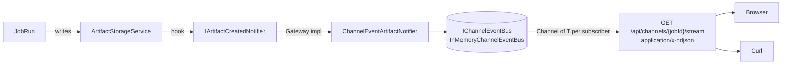

# Diagram — Channels concept

> Mirrored from [`docs/architecture/20260425-concept-review.md`](../20260425-concept-review.md) §5 (UX).
>
> **Architecture rule:** OpenClawNet does **not** use SignalR for new
> real-time features. Channel updates are delivered via HTTP NDJSON,
> mirroring the chat-stream pattern.

## What a channel is

A **channel** is the user-visible live view of artifacts produced by a
single job. There is no `Channel` entity — a channel is just
"`JobRunArtifact` rows for `JobId = X`, plus a real-time push of new
ones."

## Data flow

## Why NDJSON instead of SignalR

- Same wire shape as `POST /api/chat/stream` — one mental model.
- No SignalR client runtime, no negotiation handshake.
- Trivial to consume from `curl`, `fetch`, Python, anything HTTP-aware.
- Works through any plain HTTP/1.1 proxy that does not aggressively
  buffer.

See [`../../demos/channel-realtime.md`](../../demos/channel-realtime.md)
for the full demo + endpoint reference.

## Properties of the bus

- **Bounded.** `Channel<T>` per subscriber, capacity 64,
  `BoundedChannelFullMode.DropOldest`.
- **Producer never blocks.** Slow readers cannot wedge artifact insertion.
- **Best-effort.** Notifier failures are caught and ignored; storage
  always succeeds.
- **In-memory only.** Multi-instance fan-out (e.g. Redis backplane) is
  deferred. Polling remains the cross-instance fallback.
