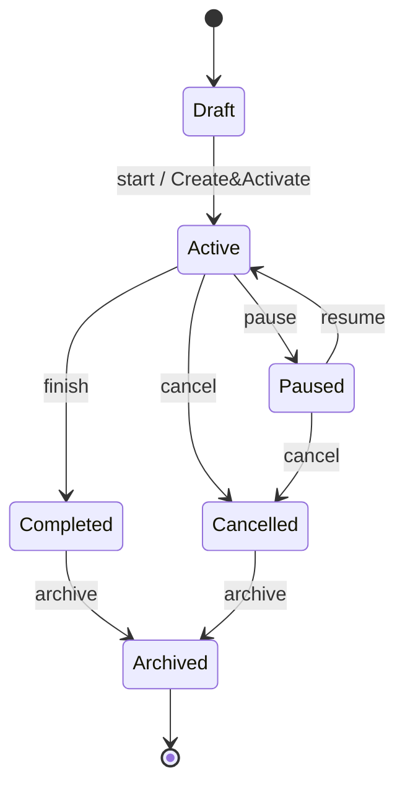

# Diagram — Job state machine

> Mirrored from [`docs/architecture/20260425-concept-review.md`](../20260425-concept-review.md) §4b.

## Rules

- All transitions are validated by `JobStatusTransitions` (unit-tested per
  edge above). Illegal transitions throw.
- Every successful transition writes a `JobDefinitionStateChange` row via
  `JobStatusChangeRecorder` (single chokepoint — endpoints never mutate
  `Status` directly).
- `GET /api/jobs` hides `Archived` by default; pass `?includeArchived=true`
  to include them.
- Demo template gallery uses the atomic
  `POST /api/jobs/from-template/{name}/activate` endpoint, which creates
  the job in `Active` state in one step (no `Draft → Active` round-trip).

## State-change row shape

| Column | Meaning |
|---|---|
| `JobDefinitionId` | FK to the job. |
| `FromStatus` | Previous status (nullable on initial creation). |
| `ToStatus` | New status. |
| `Reason` | Free-text reason if supplied by the API caller. |
| `ChangedBy` | `User` / `Scheduler` / `System`. |
| `ChangedAt` | UTC timestamp. |
