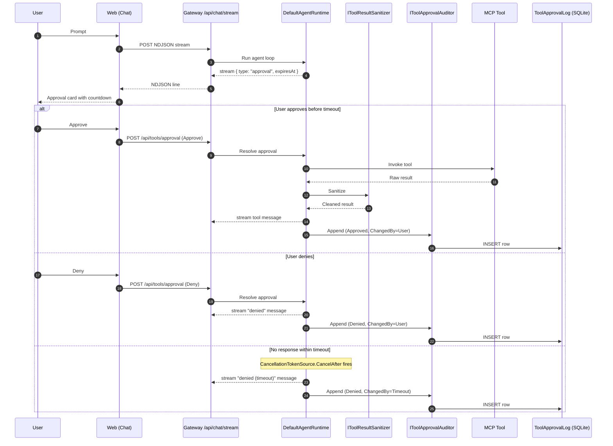

# Diagram — Tool approval sequence

> Mirrored from [`docs/architecture/20260425-concept-review.md`](../20260425-concept-review.md) §4a.

## Resolution precedence

When the runtime decides whether a tool call needs human approval, it
checks (highest to lowest priority):

1. Tool-level override on the agent profile.
2. `McpServerDefinition.DefaultRequireApproval` (server-level default).
3. Agent profile default.
4. Tool metadata `RequiresApproval`.

First non-null wins.
