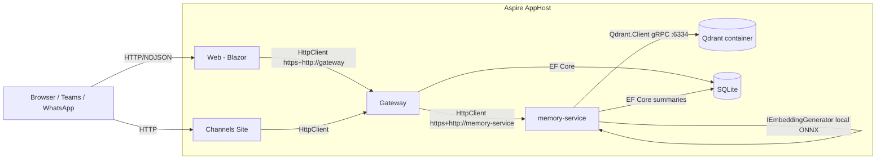

# Next-Generation Agent Memory Service — Architectural Proposal

> **✅ APPROVED (2026-05-01)** — This proposal has been accepted by Bruno with modifications noted below. Implementation is tracked in issues #98, #99, #100, and #101.
>
> Author: **Mark (Lead Architect 🏗️)** · Branch: `research/memory-service` · Audience: senior .NET architects (primary reviewer: Bruno Capuano)
>
> This document is the **historical research and design record**. No `.cs` / `.csproj` files, no AppHost edits, no Docker Compose changes, no Dockerfile changes are produced as part of this work. The doc is the entire artifact.
>
> **Superseded recommendations** are preserved inline with ~~strikethrough~~ for historical clarity. The final decisions are:
> - **Vector store:** `ElBruno.MempalaceNet` (replaces original Qdrant recommendation)
> - **Tool transport:** In-process DI against `IAgentMemoryStore` (not HTTP to `memory-service`)
> - **Interface split:** `IAgentMemoryStore` confirmed separate from `IMemoryService`

---

## 1. Summary

OpenClawNet today has a "memory" surface that is really a **conversation summarization** subsystem: an `IMemoryService` that stores LLM-generated chat summaries in SQLite and a separate `IEmbeddingsService` that wraps `Elbruno.LocalEmbeddings` but is **not used by any storage layer or retrieval path**. There is no semantic search, no per-agent isolation, no `remember(...)` write path, and no retrieval-augmented prompting.

This proposal designs a real **agent memory service**: a vector-backed, per-agent-isolated, write/read pipeline that lets every OpenClawNet agent (a) remember salient facts and episodes across sessions and (b) retrieve them via embedding similarity before each turn. The ~~recommended primary path is **Qdrant in Docker (managed by Aspire)**~~ **APPROVED path is `ElBruno.MempalaceNet`** (Bruno's own library) + local embeddings via `Elbruno.LocalEmbeddings` behind the standard `Microsoft.Extensions.AI.IEmbeddingGenerator<string, Embedding<float>>` abstraction, with a thin OpenClawNet-shaped `IAgentMemoryStore` over the top. Existing summary persistence stays in SQLite — episodic vectors live in MempalaceNet (SQLite-backed).

---

## 2. Goals & Non-Goals

### Goals

- **Per-agent memory** that survives across sessions, jobs, and process restarts.
- **Local-first / offline-first**: zero cloud dependency in the default profile; ONNX embeddings on the dev box.
- **Pluggable**: vector store and embedding generator both swappable behind a small set of interfaces.
- **Aspire-native**: new resource(s) appear in the Aspire dashboard, are health-checked, and are discovered via `https+http://<name>` like every other service.
- **NDJSON / JSON HTTP surface** consistent with the rest of OpenClawNet — no SignalR, no GraphQL.
- **Per-agent isolation** by default; a clean `forget` path (GDPR-style "delete all memories for agent X").
- **Reuse existing pieces** where they fit: keep `OpenClawNet.Memory` as the contract project, keep `OpenClawNet.Services.Memory` as the host, keep `OpenClawNet.Storage` for relational summary persistence, keep `Elbruno.LocalEmbeddings` for embeddings.
- **Observability**: OTel traces and metrics for write/embed/search.
- **A clear migration story** from today's summary-only `IMemoryService` to a richer surface — without a flag-day rewrite.

### Non-Goals

- **No implementation in this PR.** This document is the deliverable.
- **No new model providers.** Embeddings stay on the existing local stack.
- **No multi-tenant cross-agent shared memory in v1** (Phase 3 territory).
- **No replacement of the relational `Summaries` table.** Summaries remain a relational artifact; they may *also* be vectorized, but they do not move out of SQLite.
- **No re-ranker / cross-encoder in v1.** Pure ANN + payload filters first; a rerank stage is Phase 2.
- **No streaming embeddings.** Batched, request/response only.
- **No evaluation harness in v1** (recall@k, MRR, etc.). Bruno can decide when this earns priority.
- **Not a knowledge base / RAG-over-docs system.** That's a separate skill/tool. This is *agent* memory: things the agent has experienced, observed, or been told to remember.

---

## 3. Current State

The following is a faithful snapshot of memory-related code on `main` / `research/memory-service` at the time of writing. File:line citations are included so reviewers can confirm.

### 3.1 The contract project

`src/OpenClawNet.Memory/IMemoryService.cs:3-9` defines the only public memory contract today:

```csharp
public interface IMemoryService
{
    Task<string?> GetSessionSummaryAsync(Guid sessionId, ...);
    Task StoreSummaryAsync(Guid sessionId, string summary, int messageCount, ...);
    Task<IReadOnlyList<SummaryRecord>> GetAllSummariesAsync(Guid sessionId, ...);
    Task<MemoryStats> GetStatsAsync(Guid sessionId, ...);
}
```

It is **session-scoped**, **summary-only**, and has no concept of an agent. The supporting `SummaryRecord` (`IMemoryService.cs:11-18`) carries `SessionId`, `Summary`, `CoveredMessageCount`, and `CreatedAt` — no embedding, no metadata, no agent_id.

`DefaultMemoryService` (`src/OpenClawNet.Memory/DefaultMemoryService.cs:7-72`) is a straightforward EF Core implementation backed by `OpenClawDbContext.Summaries`. Storage is **SQLite via `EnsureCreatedAsync` + `SchemaMigrator`** (see `src/OpenClawNet.Storage/SchemaMigrator.cs`). The `SessionSummary` entity (`src/OpenClawNet.Storage/Entities/SessionSummary.cs`) is owned by `ChatSession` (`src/OpenClawNet.Storage/Entities/ChatSession.cs:14`).

### 3.2 The embeddings interface

`src/OpenClawNet.Memory/IEmbeddingsService.cs:3-44` defines `IEmbeddingsService` with `EmbedAsync`, `EmbedBatchAsync`, `CosineSimilarity`, and `IsAvailableAsync`. The default implementation `DefaultEmbeddingsService` (`src/OpenClawNet.Memory/DefaultEmbeddingsService.cs:11-100`) wraps `IEmbeddingGenerator<string, Embedding<float>>` from `Microsoft.Extensions.AI`, ultimately calling into `Elbruno.LocalEmbeddings`.

> **Gap:** `IEmbeddingsService` is registered in DI (`MemoryServiceCollectionExtensions.cs:11-12`) but **no caller in the solution uses it**. A grep for `IEmbeddingsService` finds only the definition file and the registration. Embeddings are produced today, but only by the standalone `EmbeddingsTool` (see §3.5) — never persisted, never searched.

### 3.3 The service host

`src/OpenClawNet.Services.Memory/Program.cs:1-14` wires up an Ollama model client and exposes a single endpoint:

`src/OpenClawNet.Services.Memory/Endpoints/MemoryEndpoints.cs:11` — `POST /api/memory/summarize`. It is purely a **summarization microservice**: take messages, ask Ollama to summarize them, return the summary. It does **not** persist anything. It does **not** embed anything. It is not, in any meaningful sense, "the memory service" — it is a summarization service that happens to live in a project called Memory.

### 3.4 The Gateway proxy / facade

`src/OpenClawNet.Gateway/Endpoints/MemoryEndpoints.cs:5-34` exposes three GETs (`/api/memory/{sessionId}/summary`, `/summaries`, `/stats`) that read directly from the in-process `IMemoryService` (i.e., the local SQLite). They do **not** proxy to `memory-service`; they hit the Gateway's own DI-registered `DefaultMemoryService`.

The `/summarize` write path is invoked from `src/OpenClawNet.Agent/DefaultSummaryService.cs:33-63`, which:
1. Reads the existing summary via `IMemoryService.GetSessionSummaryAsync`.
2. If `messages.Count >= 20`, POSTs to `https+http://memory-service/api/memory/summarize`.
3. On success, calls `IMemoryService.StoreSummaryAsync` (back to SQLite).
4. On failure, falls back to summarizing locally with a hard-coded `llama3.2` model.

### 3.5 The embeddings tool

`src/OpenClawNet.Tools.Embeddings/EmbeddingsTool.cs:13-117` is a separate `ITool` that, given an `embed` or `search` action, instantiates its **own** `LocalEmbeddingGenerator` from `ElBruno.LocalEmbeddings` (lines 98-116) and operates on candidates supplied in the call. It does not share the DI-registered generator and does not persist anything.

### 3.6 AppHost wiring

`src/OpenClawNet.AppHost/AppHost.cs:75-76`:

```csharp
var memoryService = builder.AddProject<Projects.OpenClawNet_Services_Memory>("memory-service")
    .WithHttpHealthCheck("/health");
```

Note: the `memoryService` variable is declared but **never `WithReference`-d** by other resources. The Gateway's `HttpClient("memory-service")` is registered manually at `src/OpenClawNet.Gateway/Program.cs:192`. A follow-up issue: this should probably use `.WithReference(memoryService)` from Gateway/Web for proper service-discovery wiring — listed in §22.

### 3.7 Honest gaps (today)

- ❌ No semantic search anywhere.
- ❌ No per-agent partition.
- ❌ Embeddings exist but are unused by storage / retrieval.
- ❌ "Memory service" is a misnomer — it is a summarization service.
- ❌ No `remember(...)` tool, no `recall(...)` tool.
- ❌ No retention policy.
- ❌ Gateway memory endpoints do not proxy to the memory service; they read local SQLite directly.
- ❌ The skill at `src/OpenClawNet.Gateway/skills/memory/SKILL.md` advertises capabilities the runtime does not implement.

---

## 4. What "Agent Memory" Means in OpenClawNet

We adopt a deliberately small ontology, drawn from the agent-memory literature but pruned to what an OpenClawNet agent actually needs.

| Type | Meaning | Examples |
|---|---|---|
| **Episodic** | Things that happened. A user told the agent X; a job emitted artifact Y. | "User said the prod database is named `claw-prod-eus2`." "Job run 0193 produced `release-notes.md`." |
| **Semantic** | Distilled facts about the user, world, or domain. | "User prefers terse responses." "The on-call rotation lives in Teams channel `#oncall`." |
| **Procedural** | How-to memories: cached recipes the agent has built. | "When asked to deploy, run `pwsh scripts/deploy.ps1 -Env prod`." |

All three live in the same store with a `kind` discriminator. v1 ships **episodic + semantic**; procedural is a label only and not specially treated.

### Write events (what causes a memory to be created)

1. **Explicit `remember(content, [kind], [importance])` tool call** — the LLM decides.
2. **Job completion** — the agent runtime can post-job summarize and write 0..N memories.
3. **Conversation summarization** — when `DefaultSummaryService` produces a summary, also vectorize it (optional, behind config flag).
4. **System-injected** — `USER.md`, `SOUL.md`, `AGENTS.md` content can be ingested once at agent provisioning. (Phase 2.)

### Read events (what causes a memory to be retrieved)

1. **Pre-turn retrieval** — before the agent prompts the model, retrieve top-K memories for `(agent_id, query=user_message)` and inject them as a `system` message (or into the workspace section).
2. **Explicit `recall(query, [topK])` tool call** — the LLM decides.

### Per-agent identity

OpenClawNet's `AgentRequest` (`src/OpenClawNet.Agent/AgentRequest.cs:5-31`) carries `AgentProfileName`. The **agent identifier for memory partitioning is the `AgentProfileName`** (a string slug). For agents without a named profile, fall back to the literal string `"default"`. We do not use `SessionId` for partitioning — sessions are ephemeral; agents are persistent.

---

## 5. Architecture Overview



Key points:

- **Memory service owns Qdrant.** Other services never talk to Qdrant directly.
- **Embeddings run inside `memory-service`.** No separate embeddings sidecar in v1 (the model is small enough — see §7).
- **Gateway is the only HTTP client.** Web/Channels/Agent always go through Gateway → memory-service. No browser ever hits memory-service directly. Loopback gating is enforced on memory-service exactly like other internal services.
- **SQLite still hosts summaries** (relational) and any operational metadata. Qdrant hosts vectors + payload.

---

## 6. Vector DB Choice

> **DECISION (2026-05-01): `ElBruno.MempalaceNet`** — Bruno's final decision supersedes the original Qdrant recommendation below. See [PR #72 comment](https://github.com/elbruno/openclawnet-plan/pull/72#issuecomment-4357602751) for the full evaluation. Implementation tracked in **#98**.

| Option | Aspire-friendly | .NET client | Persistence | Ops cost (solo dev) | Offline | Verdict |
|---|---|---|---|---|---|---|
| **MempalaceNet** ⭐ | ⚠️ None yet — runs as library | ✅ First-class (NuGet, M.E.AI) | ✅ SQLite backend | ✅ Low (in-process) | ✅ | **APPROVED** |
| ~~**Qdrant** (Docker)~~ | ✅ first-class `AddQdrant` integration | ✅ official `Qdrant.Client` (gRPC) | ✅ volume-mounted `/qdrant/storage` | low — single container | ✅ | ~~**Original Recommendation**~~ Superseded |
| **pgvector** | ✅ `AddPostgres` + extension | ✅ Npgsql + manual SQL | ✅ in Postgres | medium — full Postgres to operate | ✅ | Strong alt if we ever add Postgres for other reasons |
| **sqlite-vec / sqlite-vss** | ❌ no Aspire integration | ⚠ requires native loadable extension | ✅ in existing SQLite file | trivial — already have SQLite | ✅ | Tempting but immature on .NET (loadable-extension story is rough on Win/Linux/macOS); skip for v1 |
| **Chroma** | ⚠ container exists; no Aspire integration | ⚠ community `ChromaDB.Client` | ✅ | low | ✅ | Python-first; weaker .NET story |
| **Milvus** | ⚠ heavy stack (etcd, MinIO) | ✅ official | ✅ | high — multi-container | ✅ | Overkill for solo-dev local-first |
| **In-process (Faiss/HNSWlib bindings)** | n/a | ⚠ P/Invoke | ❌ in-process only | trivial | ✅ | No persistence, no isolation between services |

### APPROVED: **MempalaceNet** (replaces original Qdrant recommendation)

Rationale (from Mark's evaluation):

1. **Bruno authored MempalaceNet** (`elbruno/ElBruno.MempalaceNet`), so it's already aligned with OpenClawNet's architecture patterns and embedding strategy (`ElBruno.LocalEmbeddings` with ONNX).
2. **Zero operational overhead** — MempalaceNet runs in-process with SQLite backend. No Docker daemon, no container networking, no separate health checks.
3. **Per-agent isolation is native** — Wings/Rooms/Drawers hierarchy directly maps to our agent model. No manual `tenant_id` filtering required; MempalaceNet provides it architecturally.
4. **M.E.AI integration** — `IEmbeddingGenerator<>` abstraction is built-in, matching our existing swappability pattern.
5. **Clear upgrade path** — MempalaceNet docs mention sqlite-vec or Qdrant backend for >100K vectors if needed later.

### ~~Original Recommendation: **Qdrant**~~ (superseded)

~~Rationale:~~

1. ~~**Aspire integration is one line.** `builder.AddQdrant("qdrant")` produces a container resource with a connection string the memory-service can `WithReference`. This is the "Aspire-native" criterion the rest of OpenClawNet is built around.~~
2. ~~**Mature .NET client.** `Qdrant.Client` (NuGet) is officially maintained by Qdrant, supports both REST (6333) and gRPC (6334), and exposes payload filtering — which we need for the `agent_id` partition story (§8).~~
3. ~~**Persistence is a volume.** Single Docker volume → memories survive `aspire stop` / `aspire start`. No separate DB to operate.~~
4. ~~**Solo-dev friendly.** No clusters, no etcd, no shards. The default single-node config handles tens of millions of vectors before we need to think.~~
5. ~~**Offline-capable.** The container has no network egress requirements; combined with local embeddings (§7) the entire memory subsystem works on a plane.~~
6. ~~**Filterable ANN.** Native HNSW + payload filters means "find memories for agent `X` matching query `Q`" is a single round-trip.~~

~~pgvector is the second choice and would be the right call **if and when** OpenClawNet introduces Postgres for other reasons (jobs, channels). Until then, deploying Postgres just for vectors adds operational surface that solo Bruno does not need.~~

~~sqlite-vec is intellectually attractive (single-file DB, zero new resources) but the loadable-extension shipping story across the three dev OSes Bruno uses is a hidden tax we should not take in v1. Revisit when the .NET wrapper matures.~~

---

## 7. Embeddings Strategy

### Recommendation: **default to local ONNX via `Elbruno.LocalEmbeddings`**, swap-able through `IEmbeddingGenerator<string, Embedding<float>>`.

### Why local first

- OpenClawNet's positioning is "local-first AI assistant." Embeddings going to a hosted endpoint would silently break that promise for every memory write.
- Embedding cost is the highest-frequency LLM call we will make (every chat turn × every memory write). Doing it locally removes a per-token cost and a network hop.
- The model is small (see below).

### Model recommendation

- **Default: `sentence-transformers/all-MiniLM-L6-v2`** (384-dim, ~22M params). This is what `Elbruno.LocalEmbeddings` ships out of the box. It is the de-facto baseline in the embeddings literature, well-understood, and good enough for chat-scale corpora.
- **Optional opt-in: `Microsoft Harrier-OSS-v1`** (640-dim) via `ElBruno.LocalEmbeddings.Harrier`. Higher quality, larger artifact. Bruno-decision.
- **Other candidates considered & deferred:** `bge-small-en-v1.5` (384-dim, slightly better recall but not in ElBruno's stock model set), `nomic-embed-text` (768-dim, requires Ollama runtime — adds a hard dependency on Ollama for memory).

### Abstraction

The .NET ecosystem has converged on `Microsoft.Extensions.AI.IEmbeddingGenerator<string, Embedding<float>>`. **We depend on that interface, not on `Elbruno.LocalEmbeddings` types.** This means:

- A future swap to Azure OpenAI / OpenAI / GitHub Models / Ollama is a DI registration change, not a code change.
- The existing `IEmbeddingsService` becomes a thin helper around `IEmbeddingGenerator` (it already is — see `DefaultEmbeddingsService.cs:34`). We may keep it for `CosineSimilarity` + `IsAvailableAsync` ergonomics or fold those into the new `IAgentMemoryStore`. See §15.

### Operational details

- **Batching.** All write paths build a list and call `EmbedBatchAsync` once. We never embed in a tight loop.
- **Caching.** Embeddings are cached by `SHA256(content)` in a tiny SQLite table to avoid re-embedding identical content (e.g., repeated user phrases).
- **Dimensions are wired into the Qdrant collection at creation time.** Changing the embedding model requires creating a new collection; we encode the model name + dimensions in the collection name (`mem_v1_minilm384`), so the collection is self-describing.

---

## 8. Per-Agent Isolation Model

### Recommendation: **single shared collection + payload filter on `agent_id`**, with an explicit "isolation guard" enforced at the `IAgentMemoryStore` boundary.

Two viable models exist:

| Model | Pros | Cons |
|---|---|---|
| **Collection-per-agent** | Strongest physical isolation; trivial "forget" (drop collection) | Qdrant collection creation has cost; many small collections; awkward for cross-agent admin views; requires dynamic provisioning |
| **Shared collection + `agent_id` payload filter** ⭐ | One collection to manage; cheap; ANN index amortized | Isolation depends on every query carrying the right filter — must enforce at the contract boundary |

We pick **shared collection** because:

- An OpenClawNet user will frequently have a handful of personal agents (`mark`, `helly`, `irving`, `dylan`, `scribe`, ...) — not thousands.
- Qdrant payload-indexed filters are O(log n) on the filter and don't hurt ANN performance meaningfully at our scale.
- "Forget agent X" becomes a single `DeletePoints(filter: agent_id == X)` call — fast enough.
- Operations (counts, exports, stats) can join across agents without N collection round-trips.

### The isolation guard

Every method on `IAgentMemoryStore` takes `agentId` as the first parameter. **The implementation builds the Qdrant `Filter` from that parameter and merges it with any user-supplied filter via `must`.** There is no API path that lets a caller search without an `agent_id`. Code review checklist item: any new memory store method MUST take `agentId` as its first parameter.

### "Forget me"

```
DELETE /api/memory/{agent}            -> drop everything for that agent
DELETE /api/memory/{agent}/{memoryId} -> drop one
```

Both translate to Qdrant `DeletePoints` calls scoped by `agent_id` filter. We also wipe any cached embeddings owned by that agent (the cache is by content hash but we keep an `agent_id` index for cleanup).

---

## 9. Data Model

### Memory record (logical schema, stored as Qdrant point)

| Field | Type | Notes |
|---|---|---|
| `id` | `Guid` (Qdrant `PointId`) | Stable, client-generated |
| `vector` | `float[384]` | Embedding of `content` (or `content_for_embedding`, see below) |
| `payload.agent_id` | `string` | Profile name slug; payload-indexed |
| `payload.kind` | `string` | `episodic` / `semantic` / `procedural` |
| `payload.content` | `string` | The human-readable memory text (≤ ~4 KB) |
| `payload.source` | `string` | `chat`, `job`, `tool:remember`, `summary`, `system` |
| `payload.session_id` | `Guid?` | Origin session, if any |
| `payload.job_run_id` | `Guid?` | Origin job run, if any |
| `payload.metadata` | `object` | Free-form JSON (e.g., `{"channel":"teams"}`) |
| `payload.created_at` | `int64` (unix-ms) | For recency filter / decay |
| `payload.ttl_at` | `int64?` | Optional expiry, sweeper-honored |
| `payload.importance` | `float` (0..1) | Default `0.5`; used for ranking + retention |
| `payload.content_hash` | `string` | SHA-256 of `content`; for dedup |

Indexed payload fields: `agent_id`, `kind`, `created_at`, `ttl_at`, `content_hash`.

### JSON example

```json
{
  "id": "8a3c2b9e-1f04-4d6b-9d2c-66a1b1c0e7f1",
  "vector": [0.0123, -0.0456, "...384 floats..."],
  "payload": {
    "agent_id": "mark",
    "kind": "semantic",
    "content": "Bruno prefers terse, opinionated architectural proposals with explicit recommendations.",
    "source": "tool:remember",
    "session_id": "0193ab01-...",
    "job_run_id": null,
    "metadata": { "tool_call_id": "rem_42" },
    "created_at": 1782345678901,
    "ttl_at": null,
    "importance": 0.8,
    "content_hash": "8c4f...e2"
  }
}
```

### Relational sidecar (SQLite)

We add **one** new table for embedding cache:

| Column | Type | Notes |
|---|---|---|
| `ContentHash` | `TEXT PRIMARY KEY` | SHA-256 |
| `Model` | `TEXT` | e.g., `minilm-l6-v2` |
| `Vector` | `BLOB` | Float32 packed |
| `CreatedAt` | `DATETIME` | |

Existing `Summaries` table is unchanged.

---

## 10. Write Path / Ingestion Pipeline

### Sources

1. **Explicit `remember` tool call** (synchronous from agent perspective).
2. **Job completion hook** (asynchronous, fire-and-forget).
3. **Summarization side-effect** (when `DefaultSummaryService` writes a summary, also enqueue a vector write; behind config flag `Memory:VectorizeSummaries`).
4. **System ingest** (Phase 2).

### Pipeline

```
caller
  └─► IAgentMemoryStore.RememberAsync(agentId, content, kind, metadata, importance, ct)
        ├─► sanitize(content)               // length cap, control-char strip
        ├─► hash = SHA256(content)
        ├─► dedup check (recent same hash + same agent → return existing id)
        ├─► vector = embeddingCache.GetOrEmbed(hash, content)
        └─► Qdrant.UpsertAsync(point)
              ├─► payload includes agent_id, kind, source, importance, ts
              └─► id = Guid.NewGuid() (or stable id from caller)
```

### Sync vs async

- **`remember` tool calls are sync** (the LLM expects a result token) but bounded by a short timeout (e.g., 2s). On timeout we return a non-blocking ack and complete in the background.
- **Job-completion writes are async** via a `Channel<MemoryWriteJob>` consumed by a `BackgroundService` inside `memory-service`. No new infra (no MQ).

### Deduplication

- Same `(agent_id, content_hash)` within a configurable window (default 24h) → no new point; bump `importance` on the existing one slightly (e.g., `+0.05`, capped at `1.0`).

### Importance scoring (v1)

- Default `0.5`.
- `tool:remember` callers may pass `importance ∈ [0,1]`.
- Job-completion writes get importance derived from job exit status (`success → 0.4`, `failure → 0.7` because failures are more memorable).
- Phase 2: importance decay over time + reinforcement on retrieval.

---

## 11. Read Path / Retrieval Pipeline

### Pre-turn retrieval (the common case)

```
agent runtime, before each turn:
  query = user_message
  vec   = embed(query)
  hits  = Qdrant.Search(
            collection = mem_v1_minilm384,
            vector     = vec,
            filter     = { must: [ { agent_id == request.AgentProfileName } ] },
            limit      = topK (default 5)
          )
  hits  = post_filter(hits, recency_weight=0.2, importance_weight=0.3)
  context_block = render_as_markdown(hits)
  prompt.system_blocks.append(context_block)
```

### Explicit `recall(query, topK?)` tool

Same as above but called from inside the tool loop. Returns the hit list as JSON the LLM can quote.

### Post-filter scoring (v1)

`final_score = 0.5 * cosine_similarity + 0.3 * importance + 0.2 * recency_score`

where `recency_score = exp(-age_days / 30)`.

### Reranking (Phase 2)

Plug a cross-encoder (e.g., `bge-reranker-base` ONNX) between ANN and final selection. Out of scope for v1.

### Context budget

Memory injection is bounded by token budget (default: 1500 tokens, configurable per profile). If the top-K render exceeds the budget, we drop from the bottom. Memory injection NEVER preempts the user message or workspace docs.

### Closed by E2E demo

The Remember → Recall round-trip described in this section is exercised end-to-end by `tests/OpenClawNet.IntegrationTests/Memory/MemoryRoundTripE2ETests.cs` (plan issue #103). The two facts demonstrate are: (a) a fact stored in turn 1 via `RememberTool` is retrieved in turn 2 via `RecallTool` and surfaces in the assistant response, and (b) two distinct `AgentProfileName` requests against the same `MempalaceAgentMemoryStore` cannot read each other's memories — Bob's recall of Alice's secret returns `count=0` at the tool layer.

---

## 12. Retention, Forgetting, and Lifecycle

| Mechanism | v1 | Phase 2 |
|---|---|---|
| **Hard TTL** (`ttl_at`) | Sweeper `BackgroundService` runs hourly, deletes expired points | same |
| **Per-agent cap** (e.g., 100k) | When exceeded, evict lowest `final_score` first | same |
| **Importance decay** | None | Linear decay over 90 days, floored at 0.1 |
| **Manual purge** | `DELETE /api/memory/{agent}/{id}` and `DELETE /api/memory/{agent}` | same + bulk filter delete |
| **Reinforcement on read** | None | Bump importance on retrieval |
| **Export** | None | `GET /api/memory/{agent}/export` → NDJSON dump |

Defaults are loud and conservative (no auto-deletes in v1 except TTL). Bruno can flip retention knobs via `appsettings.json`.

---

## 13. API Surface (HTTP)

> **DECISION (2026-05-01): RememberTool/RecallTool use in-process DI, not HTTP.** The memory service HTTP API is retained for Gateway proxying and administrative operations, but the primary tool path is now via direct `IAgentMemoryStore` injection. Implementation tracked in **#100**.

All endpoints live under **memory-service** at `/api/memory/...`. The Gateway proxies them under the same path. memory-service is **loopback-gated** the same way other internal services are; only Gateway and AppHost-orchestrated peers can reach it.

**Note:** `RememberTool` and `RecallTool` now inject `IAgentMemoryStore` directly via DI rather than calling these HTTP endpoints. This reduces latency on the hot path and simplifies the test surface. The HTTP endpoints remain for:
- Gateway proxy operations (admin UI, external integrations)
- Cross-service access patterns (if ever needed)
- Diagnostics and debugging

| Verb | Path | Purpose | Body / Query | Response |
|---|---|---|---|---|
| `POST` | `/api/memory/{agent}/remember` | Write a memory | `{ content, kind?, source?, sessionId?, jobRunId?, metadata?, importance?, ttl? }` | `{ id, agent, kind, createdAt, deduplicated: bool }` |
| `POST` | `/api/memory/{agent}/search` | Vector search | `{ query, topK?, kind?, since?, minImportance? }` | `{ hits: [{ id, content, kind, score, importance, createdAt, metadata }] }` |
| `GET` | `/api/memory/{agent}` | List recent | `?limit=50&kind=...&since=...` | `{ items: [...] }` |
| `GET` | `/api/memory/{agent}/{id}` | Read one | — | `{ id, content, ... }` |
| `DELETE` | `/api/memory/{agent}/{id}` | Delete one | — | `204` |
| `DELETE` | `/api/memory/{agent}` | Forget all for agent | `?confirm=true` (required) | `{ deleted: N }` |
| `GET` | `/api/memory/{agent}/stats` | Stats | — | `{ count, byKind, oldest, newest, avgImportance }` |
| `POST` | `/api/memory/summarize` | (existing) Summarize messages | unchanged | unchanged |
| `GET` | `/api/memory/{sessionId:guid}/summary` | (existing) Get summary | unchanged | unchanged |

### Streaming

- **`/search`** could stream NDJSON for very large topK, but v1 returns JSON. NDJSON is reserved for genuinely streaming workloads (chat, job logs). Memory search results are bounded and small.
- **Bulk export** (Phase 2) is NDJSON to match OpenClawNet conventions.

### Auth / loopback

- memory-service uses the same `IsLoopbackRequest` gate the Channels API uses (per `.squad/agents/mark/history.md` learnings, all internal services share this pattern).
- The Gateway adds a per-agent authorization check against the active session (the gateway already knows who the user is; memory-service does not need to).

---

## 14. Aspire Topology Changes

> **DECISION (2026-05-01): MempalaceNet runs in-process; no Qdrant container needed.** The topology is simpler than originally proposed — no new container resource required.

**No code in this section — descriptive only.** Implementation belongs to a future PR.

~~New resources to add to AppHost:~~

~~1. **`qdrant`** — a Qdrant container with a persistent volume. Aspire ships an integration; the equivalent of `builder.AddQdrant("qdrant").WithDataVolume()`. Exposes REST (6333) and gRPC (6334).~~
~~2. **(no new service)** — `memory-service` already exists. Wire it as `WithReference(qdrant)` so the gRPC endpoint resolves via service discovery. memory-service reads the connection string from Aspire-injected configuration.~~

**APPROVED topology with MempalaceNet:**

1. **No new container** — MempalaceNet runs in-process with SQLite backend. No `AddQdrant()` call needed.
2. **`memory-service`** — already exists. Wire `IAgentMemoryStore` (backed by MempalaceNet `IPalace`) via `AddSingleton<>` or extension method. The SQLite file lives alongside existing OpenClawNet data.
3. **Tools inject directly** — `RememberTool` and `RecallTool` receive `IAgentMemoryStore` via DI constructor injection, not HTTP.

Wiring changes (descriptive):

- `gateway` should `WithReference(memoryService)` (currently missing — see §3.6 / §22).
- ~~`memoryService` should `WithReference(qdrant).WaitFor(qdrant)`.~~ Not needed with MempalaceNet.
- The local-embeddings model cache directory must be a persistent volume so the model isn't redownloaded on each `aspire start`. `EmbeddingsTool.cs:105` already points at `StorageOptions.ModelsPath`; we reuse that — no new volume needed if `memory-service` mounts the same `models/` path.

Service discovery from Gateway → memory-service stays exactly as it is today: `https+http://memory-service`.

---

## 15. Migration from Existing Memory Code

Goal: **no flag-day rewrite.** Existing summary endpoints keep working throughout.

### Step-by-step (descriptive only — no code in this PR)

1. **Expand `IMemoryService`** (or introduce sibling `IAgentMemoryStore` — Bruno-decision, see §19) with the new methods: `RememberAsync`, `SearchAsync`, `ListAsync`, `GetAsync`, `DeleteAsync`, `ForgetAgentAsync`, `GetAgentStatsAsync`. Keep the four existing methods unchanged.
2. **Move `DefaultMemoryService` to `SummaryMemoryService`** (rename) — keep it implementing the summary part only.
3. **Add `QdrantAgentMemoryStore`** in `OpenClawNet.Memory` (or a new `OpenClawNet.Memory.Qdrant` adapter project for clean references). Depend on `Qdrant.Client` and `Microsoft.Extensions.AI`.
4. **Add the embedding cache table** to `OpenClawDbContext` (relational sidecar — see §9). This is an `EnsureCreatedAsync`-friendly additive change.
5. **In memory-service `Program.cs`** (future work, NOT this PR):
   - Add `builder.Services.AddQdrantClient(...)` from Aspire-injected config.
   - Add `builder.Services.AddLocalEmbeddings(...)` (already wired in `MemoryServiceCollectionExtensions`).
   - Map the new endpoints from §13.
6. **In Gateway** — replace the local-SQLite `MemoryEndpoints` with proxy endpoints that forward to memory-service. The Gateway should not own Qdrant.
7. **Add `RememberTool` and `RecallTool`** in `OpenClawNet.Tools.Memory` (new project) using `IAgentMemoryStore` via DI in the agent process — or, more in line with the rest of OpenClawNet, calling memory-service over HTTP. Pick one consistently with how other tools work (most go through their own services).
8. **Wire pre-turn retrieval** in `DefaultAgentRuntime` — single `SearchAsync` call before composing the prompt, results injected into the system block.
9. **Retire `EmbeddingsTool`** as a user-facing tool (keep the project for now; deprecate in changelog). Its functionality is subsumed by `RecallTool`. Or keep it as a low-level diagnostic — Bruno-decision.

### Files that change (forecast — for review only)

| File | Change |
|---|---|
| `src/OpenClawNet.Memory/IMemoryService.cs` | Expand or split into two interfaces |
| `src/OpenClawNet.Memory/DefaultMemoryService.cs` | Rename → `SummaryMemoryService`; remains SQLite-only |
| `src/OpenClawNet.Memory/MemoryServiceCollectionExtensions.cs` | Register Qdrant client + new store |
| `src/OpenClawNet.Storage/OpenClawDbContext.cs` | Add `EmbeddingCache` DbSet |
| `src/OpenClawNet.Services.Memory/Program.cs` | Map new endpoints; add Qdrant DI |
| `src/OpenClawNet.Services.Memory/Endpoints/MemoryEndpoints.cs` | Add `/remember`, `/search`, `/list`, `/delete`, `/stats` |
| `src/OpenClawNet.Gateway/Endpoints/MemoryEndpoints.cs` | Convert to proxy; add the new verbs |
| `src/OpenClawNet.Gateway/Program.cs` | (already has `memory-service` HttpClient) — add new client routes |
| `src/OpenClawNet.AppHost/AppHost.cs` | Add `AddQdrant`; add `.WithReference` chain |
| `src/OpenClawNet.Agent/DefaultAgentRuntime.cs` | Pre-turn retrieval call |
| `src/OpenClawNet.Tools.Memory/` (new) | `RememberTool`, `RecallTool` |
| `src/OpenClawNet.Tools.Embeddings/EmbeddingsTool.cs` | Deprecate or repurpose |
| `src/OpenClawNet.Gateway/skills/memory/SKILL.md` | Rewrite to match real capabilities |

---

## 16. Testing Strategy

| Layer | What | How |
|---|---|---|
| **Unit** | `IAgentMemoryStore` contract — dedup, isolation guard, ranking math | xUnit + an `InMemoryQdrantStore` test double (a small dictionary-backed fake) |
| **Unit** | Embedding cache hits | xUnit with EF Core InMemory provider |
| **Integration** | Real Qdrant + real embeddings end-to-end | Testcontainers for .NET (`Testcontainers.Qdrant`) — spin Qdrant per test class. Skipped on environments without Docker via `[SkippableFact]` |
| **Integration** | Pre-turn retrieval injects expected memories | Spin agent runtime with stubbed model client; assert system prompt contains rendered hits |
| **Live** | The default ONNX model loads and produces 384-d vectors | Single `[Fact]` gated behind `OPENCLAW_LIVE=1` |
| **Contract** | HTTP shape stable across renames | Snapshot test with Verify.NET on the OpenAPI document |

We do NOT add a new test framework. xUnit + Testcontainers are already in the repo.

---

## 17. Observability

OpenClawNet already uses OpenTelemetry via `ServiceDefaults`. We add:

### Traces (ActivitySource: `OpenClawNet.Memory`)

- `memory.remember` — tags: `agent_id`, `kind`, `source`, `dedup_hit`, `embed_ms`, `qdrant_ms`
- `memory.search` — tags: `agent_id`, `top_k`, `hit_count`, `embed_ms`, `qdrant_ms`, `total_ms`
- `memory.delete` — tags: `agent_id`, `scope` (`one`/`all`), `deleted_count`

### Metrics (Meter: `OpenClawNet.Memory`)

| Metric | Type | Tags | Notes |
|---|---|---|---|
| `memory.writes.total` | counter | `agent_id`, `kind`, `source`, `deduplicated` | |
| `memory.search.total` | counter | `agent_id` | |
| `memory.search.latency` | histogram (ms) | `agent_id` | p50/p95/p99 dashboard |
| `memory.embed.latency` | histogram (ms) | `model` | catches embedding regressions |
| `memory.points.count` | observable gauge | `agent_id` | sampled from Qdrant `count` API |
| `memory.quota.exceeded` | counter | `agent_id` | per-agent cap hits |

### Logs

Standard `ILogger<T>` with structured properties matching the trace tags. No new sinks.

---

## 18. Security & Privacy

- **Loopback-only.** memory-service is reachable only from inside the Aspire process group (loopback-gated, identical pattern to `ChannelsApiEndpoints`).
- **No content leaves the box** in the default profile. Local embeddings + local Qdrant.
- **Sanitization on write.** Strip control characters; cap content length (default 8 KB) at the API boundary; reject zero-length.
- **PII handling.** v1 does not auto-detect PII. Bruno can opt in to a PII redaction filter (Phase 2). The `metadata` field is a free-form JSON object, so callers MUST NOT put secrets there — documented in the SKILL.
- **Encryption at rest.** Qdrant v1.x does not encrypt its on-disk segments natively. Local storage relies on disk-level protection (BitLocker / FileVault / LUKS — out of scope). Document this.
- **No auth on memory-service itself**; the Gateway is the trust boundary. Memory writes carry the `agent_id` from the gateway-resolved `AgentProfileName`, never from the client.
- **"Forget me"** is a single API call (§13). No async tombstoning needed at our scale.

---

## 19. Open Questions / Decisions Bruno Needs to Make

> **All questions RESOLVED (2026-05-01).** See [Bruno's acceptance comment](https://github.com/elbruno/openclawnet-plan/pull/72#issuecomment-4357623123).

1. ~~**Vector store: Qdrant vs pgvector?**~~ **RESOLVED → MempalaceNet.** Bruno selected his own library over both options. Implementation: **#98**.
2. ~~**Per-agent isolation: shared collection + filter, or collection-per-agent?**~~ **RESOLVED → Wings/Rooms hierarchy** (MempalaceNet native). Per-agent isolation is architectural, not filter-based.
3. ~~**Single interface (`IMemoryService` expanded) or split into `ISummaryService` + `IAgentMemoryStore`?**~~ **RESOLVED → Split confirmed.** Implementation: **#99**.
4. **Does `DefaultSummaryService` also vectorize summaries?** Recommendation yes, behind a config flag, default on. *(Deferred to implementation.)*
5. **Embeddings model: stick with default `all-MiniLM-L6-v2` (384) or upgrade to `Harrier-OSS-v1` (640)?** Recommendation MiniLM in v1 — re-evaluate when we have eval data. *(Deferred to implementation.)*
6. ~~**Should `RememberTool` and `RecallTool` live in `OpenClawNet.Tools.Memory` calling `memory-service` over HTTP, or call `IAgentMemoryStore` directly via DI?**~~ **RESOLVED → In-process DI.** Implementation: **#100**.
7. **Per-agent quota default?** Recommendation 100k points, evict by lowest final_score. *(Deferred to implementation.)*
8. **Retire `EmbeddingsTool` once `RecallTool` lands, or keep as diagnostic?** Recommendation deprecate. *(Deferred to implementation.)*
9. **Loopback-gate memory-service?** Recommendation yes — matches Channels. *(Deferred to implementation.)*
10. **Phase 1 scope cut: drop pre-turn retrieval and ship `remember`/`recall` tools first?** Recommendation no — pre-turn retrieval is the highest-value feature. *(Deferred to implementation.)*

---

## 20. Phased Rollout Plan

> **Updated (2026-05-01)** to reflect MempalaceNet + DI tool transport.

### Phase 1 — MVP

- ~~Qdrant container in Aspire.~~ **MempalaceNet in-process** (SQLite backend).
- `IAgentMemoryStore` + ~~`QdrantAgentMemoryStore`~~ **`MempalaceAgentMemoryStore`**. *(#99)*
- Embedding cache table in SQLite.
- memory-service endpoints: `remember`, `search`, `list`, `get`, `delete`, `forget`, `stats`.
- Gateway proxy endpoints for the same.
- Pre-turn retrieval wired into `DefaultAgentRuntime`.
- `RememberTool` and `RecallTool` — **via in-process DI** (not HTTP). *(#100)*
- TTL sweeper.
- OTel traces + metrics.
- Unit + ~~Testcontainers~~ integration tests (no container needed with MempalaceNet).

### Phase 2 — Quality

- Importance decay + reinforcement on retrieval.
- Cross-encoder reranker (ONNX).
- PII redaction filter (opt-in).
- System ingest of `USER.md` / `AGENTS.md` at agent provisioning.
- NDJSON export.
- Per-agent quota enforcement with eviction.

### Phase 3 — Multi-agent

- Cross-agent shared "knowledge pools" (opt-in: agent A may publish a memory readable by agent B).
- Memory provenance / lineage.
- Optional hosted-embeddings profile (Azure OpenAI fallback).
- Memory eval harness (recall@k on a synthetic dataset).

---

## 21. Risks & Mitigations

| Risk | Likelihood | Impact | Mitigation |
|---|---|---|---|
| ONNX model download fails on first run / behind a corporate proxy | M | M | Pre-cache model in `models/` volume; document offline install path |
| Qdrant container disk fills on a long-running dev box | L | M | Per-agent cap + TTL sweeper + dashboard gauge |
| Embedding model upgrade silently invalidates collection | L | H | Encode model+dim in collection name (`mem_v1_minilm384`); refuse to write to a mismatched collection |
| Pre-turn retrieval injects irrelevant memories that confuse the model | M | M | Tunable topK + minScore threshold; default conservative |
| Isolation bug leaks memories cross-agent | L | H | Single-source filter construction in `QdrantAgentMemoryStore`; integration test asserts isolation |
| Memory writes block chat turns under load | L | M | Background-channel for non-critical writes; bounded sync timeout for `remember` |
| `ElBruno.LocalEmbeddings` API changes | L | L | We depend on `IEmbeddingGenerator<>`, not concrete types |

---

## 22. Follow-up issues spotted (not fixed here)

> **Tracked in #101** — single cleanup issue for all side findings below.

Per the hard constraint, these are listed only — no code changes:

1. **AppHost `memoryService` is unused.** `src/OpenClawNet.AppHost/AppHost.cs:75-76` declares the resource but no `WithReference(memoryService)` exists on Gateway/Web. The Gateway's `HttpClient("memory-service")` works because of name-based service discovery, but proper wiring would document the dependency in the Aspire graph.
2. **Gateway `MemoryEndpoints` reads SQLite directly** (`src/OpenClawNet.Gateway/Endpoints/MemoryEndpoints.cs:11-32`). With Gateway and memory-service both holding `OpenClawNet.Memory` references, two services share a contract surface — fine today, fragile tomorrow. Convert to proxy.
3. **`DefaultSummaryService` hard-codes `llama3.2`** in the local fallback path (`src/OpenClawNet.Agent/DefaultSummaryService.cs:72`). Should read from `OllamaOptions`.
4. **`IEmbeddingsService` is dead code** — registered but unused. Either delete or wire into the new memory store.
5. **`EmbeddingsTool` constructs its own `LocalEmbeddingGenerator`** (`src/OpenClawNet.Tools.Embeddings/EmbeddingsTool.cs:107-112`) instead of using the DI-registered `IEmbeddingGenerator<>` — duplicate model load.
6. **`skills/memory/SKILL.md` advertises capabilities not implemented.** Update once Phase 1 ships.

---

## 23. References

- Qdrant docs — https://qdrant.tech/documentation/
- Qdrant .NET client — https://github.com/qdrant/qdrant-dotnet
- Qdrant on NuGet — https://www.nuget.org/packages/Qdrant.Client
- .NET Aspire Qdrant integration — https://learn.microsoft.com/dotnet/aspire/database/qdrant-integration
- `Microsoft.Extensions.AI` `IEmbeddingGenerator` — https://learn.microsoft.com/dotnet/ai/microsoft-extensions-ai
- `Elbruno.LocalEmbeddings` (NuGet) — https://www.nuget.org/profiles/elbruno
- `Elbruno.LocalEmbeddings` getting-started — https://github.com/elbruno/elbruno.localembeddings/blob/main/docs/getting-started.md
- `ElBruno.MempalaceNet` (NuGet) — https://www.nuget.org/packages/ElBruno.MempalaceNet
- `ElBruno.MempalaceNet` (GitHub) — https://github.com/elbruno/ElBruno.MempalaceNet
- pgvector — https://github.com/pgvector/pgvector
- sqlite-vec — https://github.com/asg017/sqlite-vec
- Timescale "pgvector vs Qdrant" benchmark — https://www.tigerdata.com/blog/pgvector-vs-qdrant
- Sentence-Transformers `all-MiniLM-L6-v2` — https://huggingface.co/sentence-transformers/all-MiniLM-L6-v2
- OpenClawNet architecture overview — `docs/architecture/overview.md`
- OpenClawNet storage conventions — `docs/architecture/storage.md`

---

*End of proposal. **APPROVED 2026-05-01.** Implementation tracked in #98, #99, #100; side findings tracked in #101.*
