# 02 — Hello World: Create Your First Agent

Welcome! You've installed OpenClaw .NET and watched the Aspire dashboard light up green. Now let's walk through your first end-to-end experience: creating a custom agent profile, chatting with it, and (optionally) scheduling it to run a job.

By the end of this 10-minute tutorial, you will have:

- ✅ Explored the Web UI and its main navigation areas
- ✅ Verified your model provider settings
- ✅ Created an **Agent Profile** with custom instructions
- ✅ Sent a chat message and received a streaming response
- ✅ (Optional) Created a scheduled job using your new agent

---

## Prerequisites

Before you begin, make sure you have:

- ✅ Completed **[00-prerequisites.md](./00-prerequisites.md)** — all software installed
- ✅ Completed **[01-local-installation.md](./01-local-installation.md)** — Aspire running, all resources green
- ✅ At least one Ollama model pulled (e.g., `ollama pull llama3.2:3b` or `ollama pull gemma4:e2b`)

**Estimated Time:** 10–15 minutes

---

## Step 1: Open the Web App

From the **Aspire Dashboard** (the browser tab that opened when you ran `aspire start`), look at the **Resources** table. You should see a row labeled **`web`** with a green **Running** status indicator.

<!-- Screenshot placeholder: 01-aspire-dashboard.png -->
<!--  -->

Click the **Endpoint** URL next to the `web` resource. This opens the OpenClaw .NET Web UI in a new tab.

> **Tip:** Bookmark this URL — it's usually `https://localhost:7XXX` (the port changes each Aspire startup).

---

## Step 2: Tour the Home Page

You should now see the **OpenClaw .NET** home page, which defaults to the **Chat** view.

<!-- Screenshot placeholder: 01-home-page.png -->
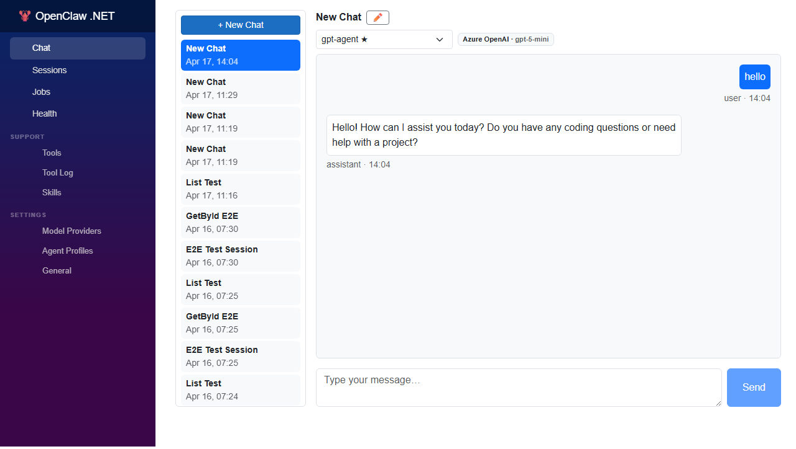

Take a moment to scan the **left sidebar navigation**. You should see menu items for:

| Menu Item | What It Does |
|-----------|--------------|
| **Chat** | The main chat interface (where you are now) |
| **Sessions** | Browse past conversation threads |
| **Tools** | View and configure available agent tools |
| **Jobs** | Create and monitor scheduled or one-shot automation |
| **Health** | System health checks and diagnostics |
| **Skills** | Browse and manage agent skills (Markdown-based) |
| **Model Providers** | Manage multiple model provider configurations |
| **Agent Profiles** | Create named agent personas with custom instructions |
| **General** (⚙️) | Global settings for model, scheduler, and memory |

We'll visit a few of these in the next steps.

---

## Step 3: Verify the Default Model Provider

Before creating an agent, let's confirm your model provider is configured correctly.

1. Click the **gear icon** (⚙️) labeled **General** in the left sidebar.
2. You should see the **Settings** page with multiple tabs at the top.
3. The **Model** tab (usually the default) shows your current provider configuration.

<!-- Screenshot placeholder: 02-settings-page.png -->
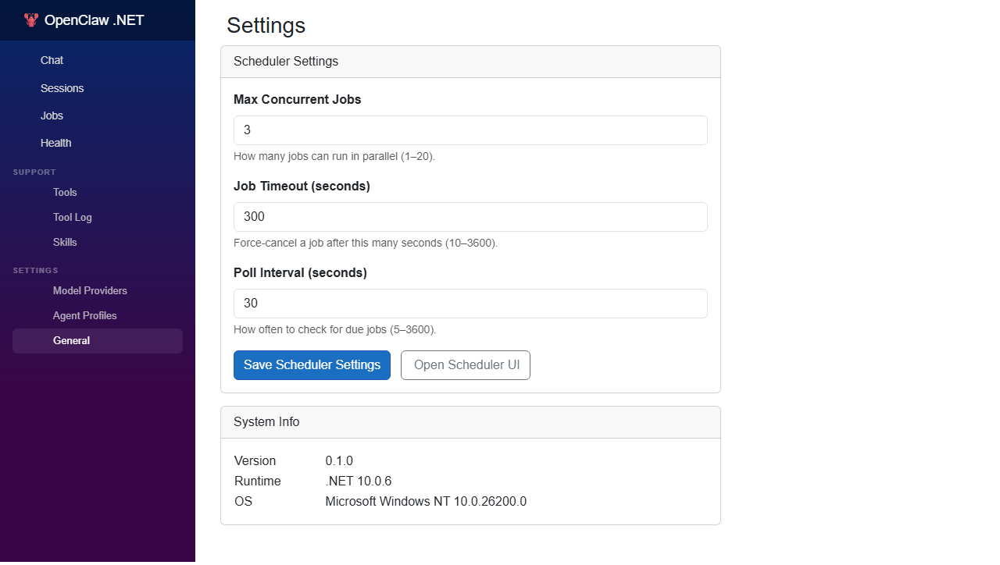

**What to check:**

| Field | Expected Value (for local setup) |
|-------|-----------------------------------|
| **Provider** | `ollama` |
| **Model** | `llama3.2:3b` or `gemma4:e2b` (whatever you pulled) |
| **Endpoint** | `http://localhost:11434` |
| **Temperature** | `0.7` (default is fine) |
| **Max Tokens** | `4096` (default is fine) |

If any field is blank or incorrect:

- Update it now
- Click **Save** (if a Save button exists)
- Or note it for the next step

> **Troubleshooting:** If the Endpoint shows `http://ollama:11434`, that's fine — Aspire's service discovery maps the `ollama` DNS name to the container. If you're not using the Aspire-managed Ollama container, change this to `http://localhost:11434`.

---

## Step 4: Create an Agent Profile

Agent Profiles let you define **named agent personalities** with custom instructions, tool access, and model overrides. Let's create one called **Hello World Agent**.

### Navigate to Agent Profiles

1. Click **Agent Profiles** in the left sidebar.
2. You should see a list of existing profiles (might be empty on first run).

<!-- Screenshot placeholder: 03-agent-profiles-list.png -->
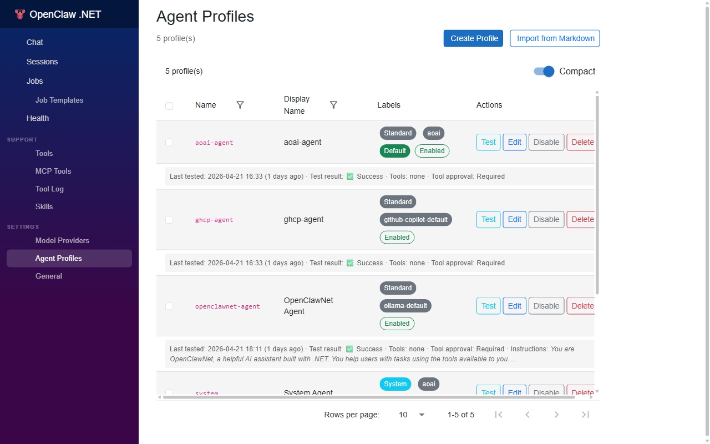

### Create a New Profile

3. Click the **+ New Profile** button (or similar — could be labeled "Create Profile").
4. You should see a form with the following fields:

<!-- Screenshot placeholder: 04-create-agent-profile-form.png -->
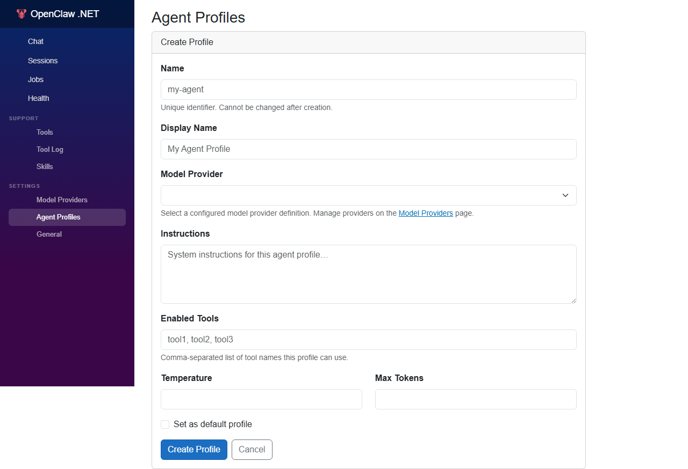

### Fill in the Form

Fill in the form as follows:

| Field | Value |
|-------|-------|
| **Name** | `Hello World Agent` |
| **Instructions** | `You are a friendly assistant who answers in a single sentence.` |
| **Provider** (optional) | Leave as `ollama` (or blank to inherit the default) |
| **Model** (optional) | Leave as `llama3.2:3b` (or blank to inherit) |

> **What are Instructions?** Think of this field as the agent's **persona prompt**. It gets injected at the start of every conversation using this profile. The shorter and clearer, the better.

### Save the Profile

5. Click **Save** or **Create**.
6. You should return to the Agent Profiles list, now showing your **Hello World Agent**.

<!-- Screenshot: 05-agent-profile-filled.png shows the filled form -->
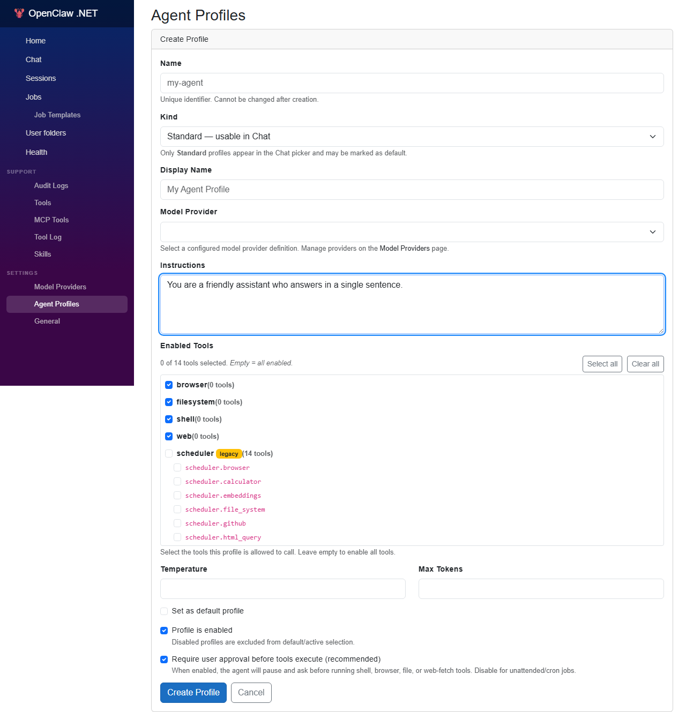

<!-- Screenshot placeholder: 06-agent-profiles-with-new.png -->
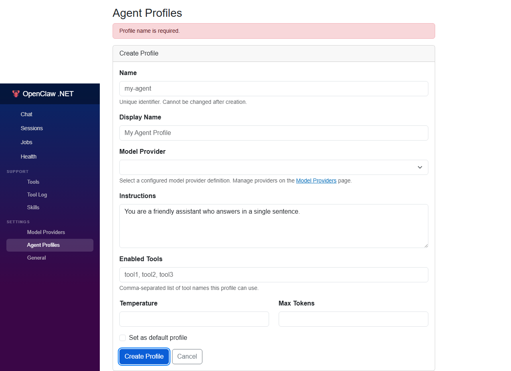

**What just happened?**

You created a reusable agent configuration. This profile is now available in the Chat page (if profile selection is supported) and in the Jobs page when creating scheduled tasks.

---

## Step 5: Test the Agent in Chat

Let's see your new agent in action.

### Navigate to Chat

1. Click **Chat** in the left sidebar (or the **OpenClaw .NET** brand logo at the top).
2. You should see the chat interface with an empty conversation (or a placeholder message).

<!-- Screenshot placeholder: 07-chat-page.png -->
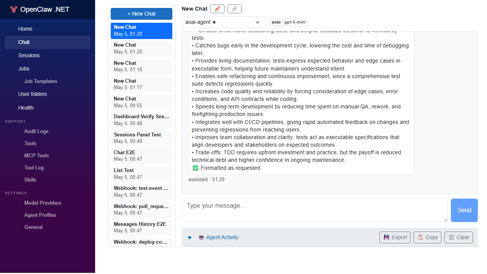

### (Optional) Select Your Agent Profile

If the Chat page shows a **Profile** dropdown or selector:

- Choose **Hello World Agent** from the list

If there's no profile selector visible:

- That's fine — the app might use the default profile or the most recently created one

### Send a Test Message

3. Type the following message in the chat input:

```
Hello, who are you?
```

<!-- Screenshot placeholder: 08-chat-message-typed.png -->
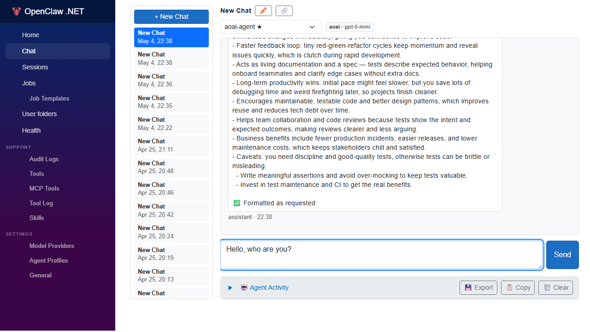

4. Press **Enter** or click the **Send** button.

### Watch the Streaming Response

Within a few seconds, you should see the assistant's response **stream in word-by-word** (if streaming is enabled) or appear all at once.

<!-- Screenshot placeholder: 09-chat-response.png -->
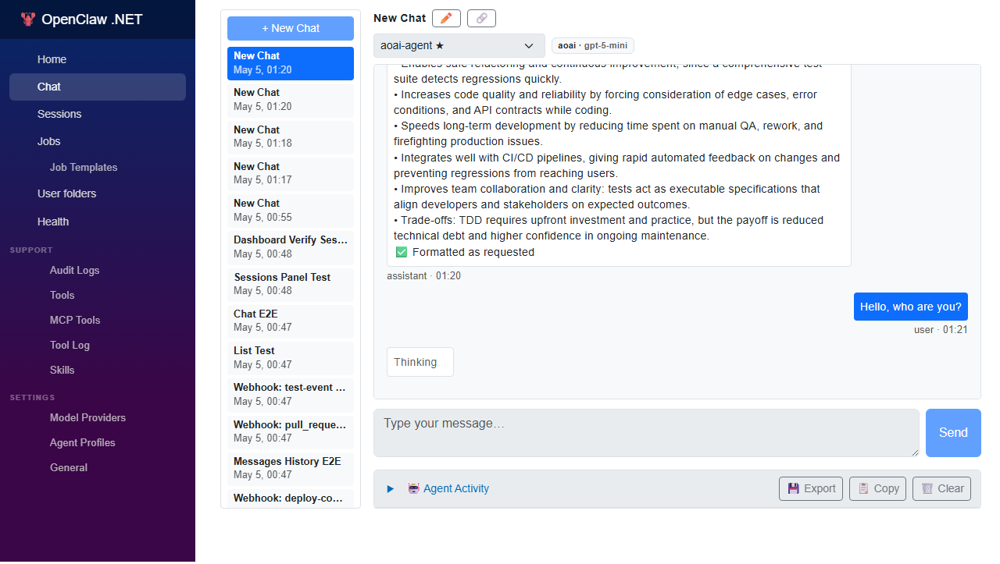

**Expected response:**

Because you told the agent to "answer in a single sentence," the response should be concise. Something like:

> *"I am a friendly assistant created to help you with questions and tasks."*

**What just happened?**

1. Your message was sent to the Gateway via an HTTP POST.
2. The Gateway loaded the **Hello World Agent** profile and merged its instructions into the system prompt.
3. The Gateway called the Ollama model provider (or whichever provider you configured).
4. The model generated a response and streamed it back to your browser via **Server-Sent Events (SSE)**.
5. Your browser rendered the response in real-time.

---

## Step 6 (Optional): Create a Job That Uses the Agent Profile

Now let's automate a simple task using your new agent. We'll create a **Manual Job** (one you trigger by clicking a button) that uses the **Hello World Agent** profile.

> **Skip this step if you want to keep things simple** — you can always come back to it after reading **[30-jobs.md](./30-jobs.md)**.

### Navigate to Jobs

1. Click **Jobs** in the left sidebar.
2. You should see a list of jobs (empty if this is your first time).

<!-- Screenshot placeholder: 10-jobs-page.png -->
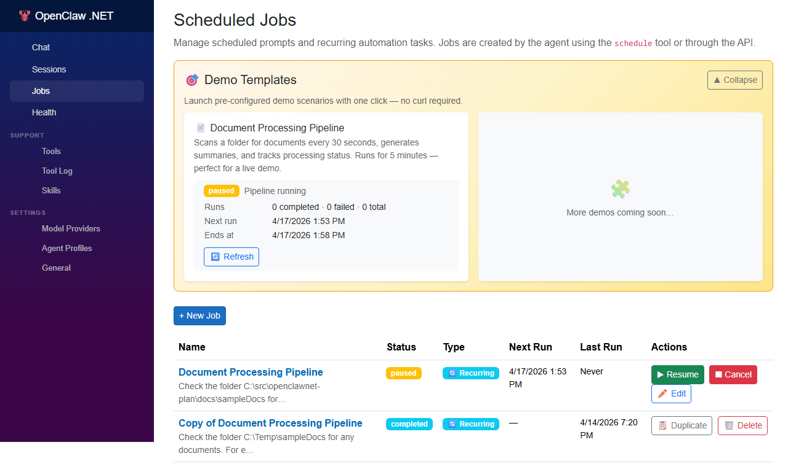

### Create a New Job

3. Click **+ New Job** (or similar).
4. You should see a form with the following fields:

<!-- Screenshot placeholder: 11-create-job-form.png -->
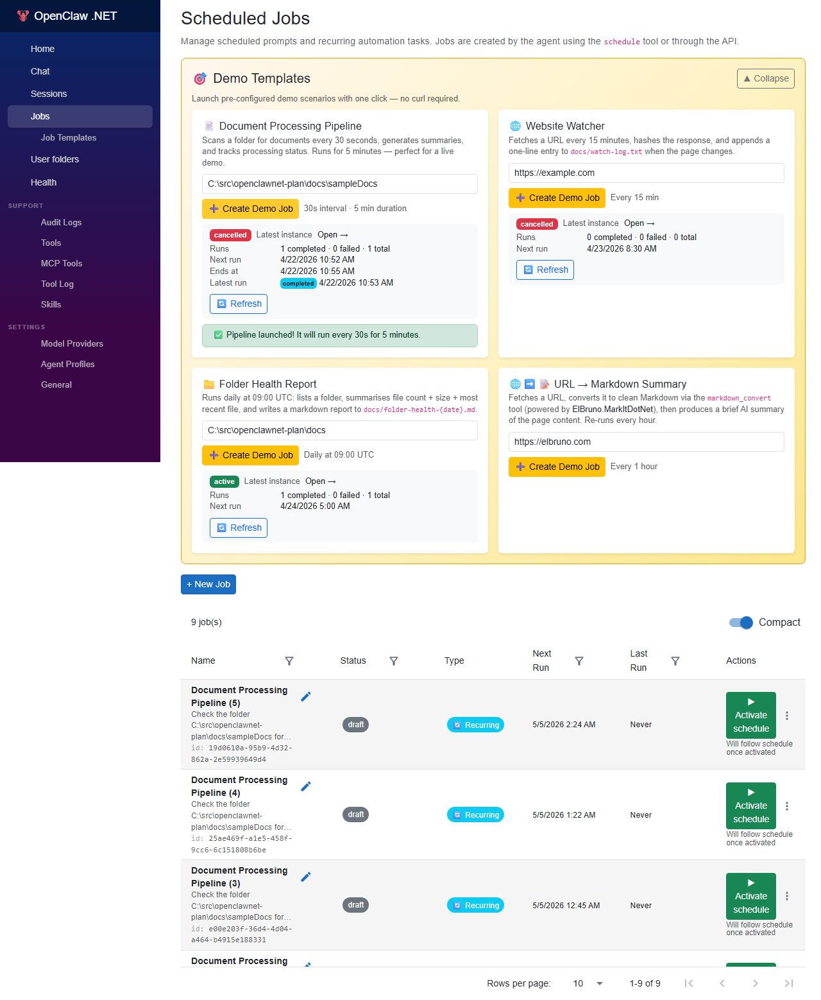

### Fill in the Form

| Field | Value |
|-------|-------|
| **Name** | `Greet on Demand` |
| **Prompt** | `Say hello and introduce yourself.` |
| **Agent Profile** | `Hello World Agent` (select from dropdown) |
| **Trigger Type** | `Manual` (or "One-Shot" with a future date) |

> **What is a Manual Job?** It's a job that only runs when you explicitly click **Execute**. No schedule, no automation — just on-demand execution.

### Save and Execute

5. Click **Save** or **Create**.
6. You should return to the Jobs list, now showing **Greet on Demand**.
7. Find the **Execute** button next to your new job (might be a ▶️ icon or an "Execute" text button).
8. Click **Execute**.

### View the Job Run History

9. The job should run immediately. After a few seconds, you should see a **Job Runs** section (or a history table) showing:
   - **Status:** `completed` (or `running` if still in progress)
   - **Result:** The agent's greeting message (e.g., *"Hello! I am a friendly assistant ready to help you."*)
   - **Executed At:** The timestamp of the run

<!-- Screenshot placeholder: 12-job-run-history.png -->
<!--  -->

**What just happened?**

1. You created a **Job** entity in the database with a **Manual** trigger.
2. When you clicked Execute, the Scheduler Service (or Gateway) invoked the job's prompt.
3. The Gateway resolved the **Hello World Agent** profile, loaded its instructions, and called the model.
4. The result was saved as a **Job Run** record in the database.

**Real-world use cases:**

- **Daily summaries** — cron job that runs every morning
- **Periodic health checks** — cron job that queries an API and reports anomalies
- **Deferred tasks** — one-shot job scheduled for a future date

See **[30-jobs.md](./30-jobs.md)** for the full guide on cron expressions, retries, chaining, and more.

---

## Troubleshooting

### Agent Profile Not Appearing in Chat

**Symptom:** You created a profile but don't see a dropdown to select it.

**Possible causes:**

1. **Profile selection not implemented yet** — Some early versions of the UI might not have a profile selector on the Chat page. The app will use the default profile or the most recently created one.
2. **Browser cache** — Hard-refresh the page (`Ctrl+Shift+R` on Windows/Linux, `Cmd+Shift+R` on macOS).

**Workaround:** Create a job with your profile (as in Step 6) to confirm the profile works.

---

### Model Not Loading or No Response

**Symptom:** You send a chat message but get no response, or you see an error like `⚠️ Model not available`.

**Possible causes:**

1. **Ollama not running** — The Ollama container might have stopped or failed to start.
2. **No model pulled** — You haven't pulled a model (or the model name in Settings is wrong).
3. **Endpoint mismatch** — The Gateway is trying to reach Ollama at the wrong URL.

**Solutions:**

1. **Check the Aspire Dashboard:**
   - Is the `ollama` resource showing **Running** (green)?
   - If not, stop and restart the AppHost.

2. **Verify the model is pulled:**
   ```bash
   ollama list
   # You should see llama3.2:3b or gemma4:e2b in the list
   ```

3. **Check the Gateway logs:**
   - In the Aspire Dashboard, click the `gateway` resource.
   - Go to the **Console Logs** tab.
   - Look for errors containing "Ollama" or "model".

4. **Test Ollama directly:**
   ```bash
   curl http://localhost:11434/api/tags
   # Should return a JSON list of models
   ```

5. **Update the Settings Endpoint:**
   - Go to **General** → **Model** tab.
   - Change `Endpoint` to `http://localhost:11434` (if it's not already).
   - Save and retry.

---

### "Settings Not Saved" or Form Validation Errors

**Symptom:** You fill out a form (Agent Profile, Settings, Job) but get a validation error or the form won't submit.

**Common issues:**

1. **Missing required fields** — Some fields might be required but not visually marked. Try filling in all visible fields.
2. **Invalid model name** — The model name must match an installed Ollama model exactly (case-sensitive).
3. **Invalid endpoint URL** — Must be a valid `http://` or `https://` URL.

**Solution:**

- Check the browser console (`F12` → **Console** tab) for validation errors.
- Fill in all fields, even optional ones.
- If the form still won't submit, file an issue: [github.com/elbruno/openclawnet-plan/issues](https://github.com/elbruno/openclawnet-plan/issues).

---

## What You Just Learned

In this tutorial, you:

- ✅ **Explored the Web UI** and its main navigation areas (Chat, Settings, Jobs, Agent Profiles)
- ✅ **Verified your model provider settings** (Ollama endpoint and model name)
- ✅ **Created an Agent Profile** with custom instructions (`Hello World Agent`)
- ✅ **Sent a chat message** and watched the streaming response
- ✅ (Optional) **Created a Manual Job** that uses your custom agent profile

You now understand the basic workflow for defining reusable agent personas and interacting with them via the Chat UI and Job Scheduler.

---

## Next Steps

Congratulations! You've built your first custom agent and seen it run in both **interactive** (Chat) and **automated** (Jobs) modes.

**Where to go from here:**

| Topic | Manual | What You'll Learn |
|-------|--------|-------------------|
| **Model Providers & Runtime Settings** | **[10-settings.md](./10-settings.md)** | Switch between Ollama, Azure OpenAI, Foundry, and GitHub Copilot. Tune temperature, max tokens, and scheduler options. |
| **Tools** | **[20-tools.md](./20-tools.md)** | Understand the built-in tools (`file_system`, `shell`, `web_fetch`, `schedule`) and how to enable/disable them for safety. |
| **Jobs & Automation** | **[30-jobs.md](./30-jobs.md)** | Master cron expressions, retry policies, job chaining, and template substitution. Create daily summaries, periodic health checks, and deferred tasks. |

**Advanced Topics** (after you've mastered the basics):

- **[docs/architecture/agent-runtime.md](../architecture/agent-runtime.md)** — Deep dive into the two-phase model calling, context compaction, and streaming pipeline.
- **[docs/architecture/provider-model.md](../architecture/provider-model.md)** — Multi-instance provider configs, fallback chains, and late-binding agent profiles.
- **[docs/architecture/jobs.md](../architecture/jobs.md)** — Jobs architecture, state machine, input/output JSON, and the scheduler polling loop.

---

## See Also

- **[Architecture Overview](../architecture/overview.md)** — High-level system design and the 9 OpenClaw pillars
- **[Agent Profiles](../architecture/provider-model.md#agent-profiles)** — Named agent definitions with late-binding
- **[Jobs Architecture](../architecture/jobs.md)** — Deep dive into scheduled and triggered jobs
- **[Skills System](../architecture/components.md#skills-system)** — Markdown/YAML skill loading with precedence

---

**Happy agent building!** 🎉

If you run into issues, check the **Troubleshooting** section above or open an issue at [github.com/elbruno/openclawnet-plan/issues](https://github.com/elbruno/openclawnet-plan/issues).
