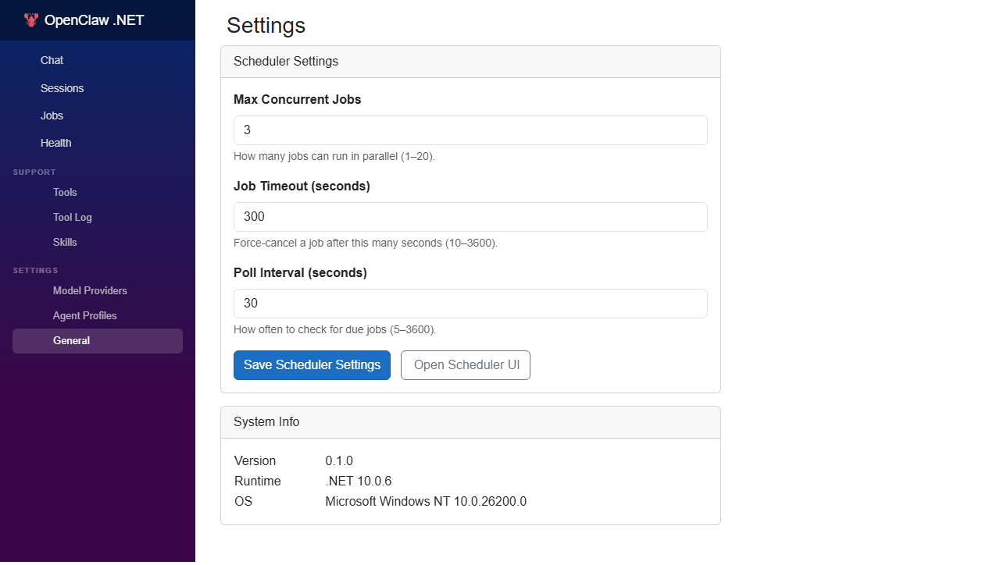
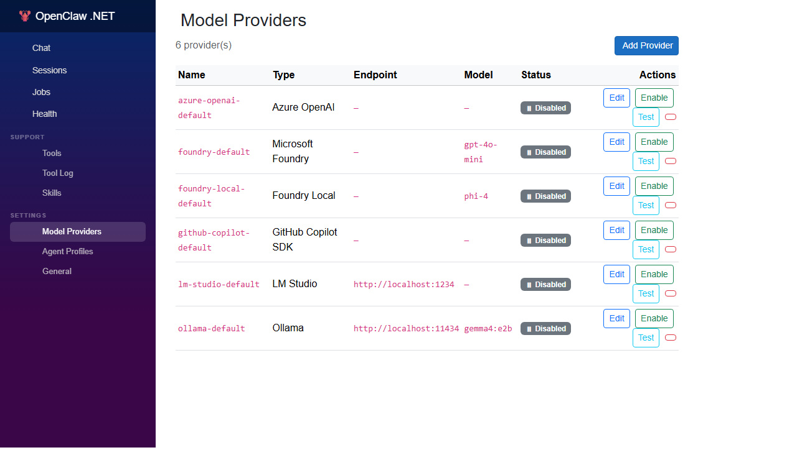
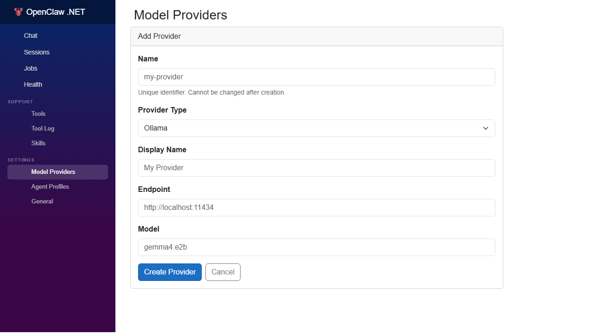
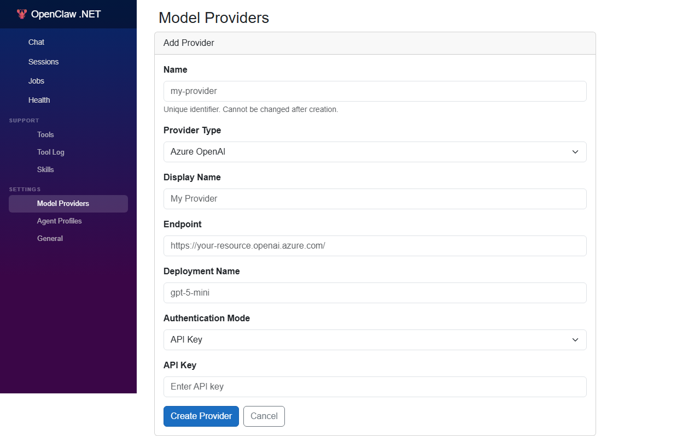
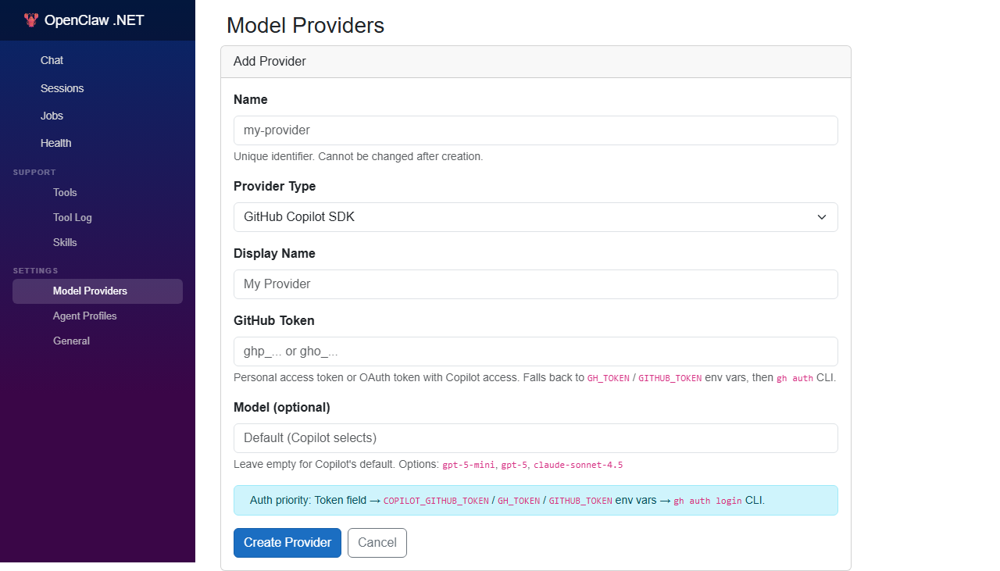
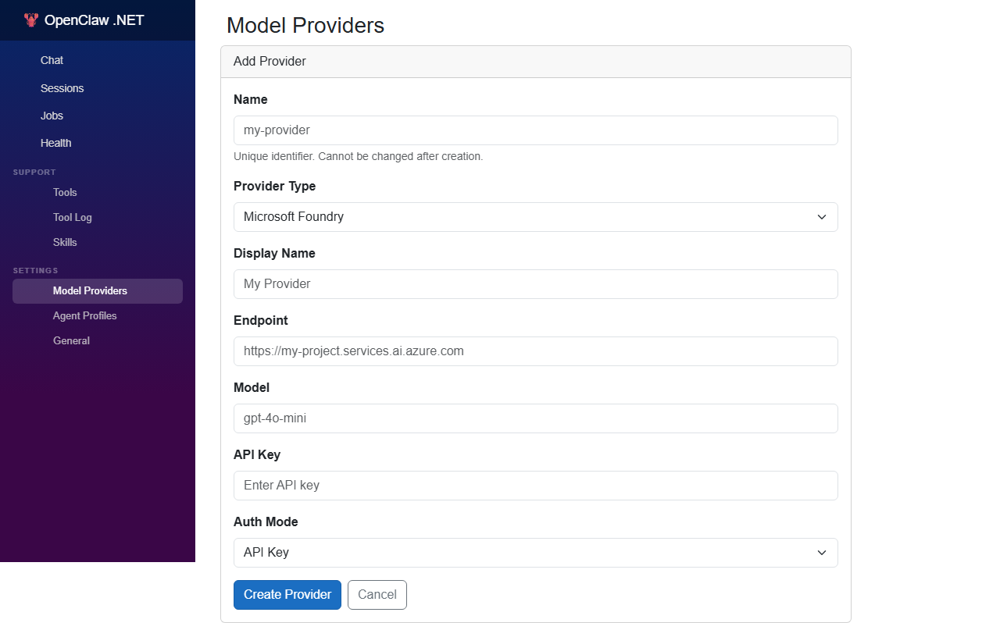
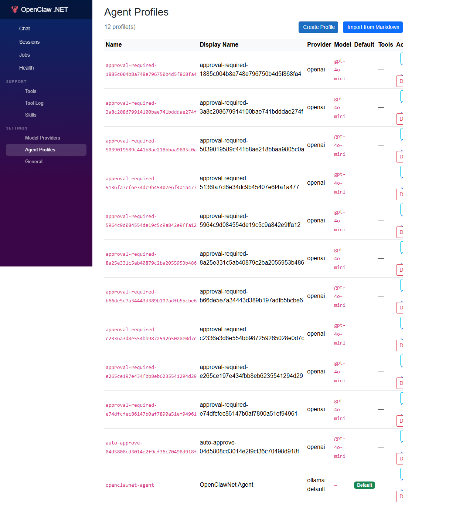

# Settings

The OpenClaw .NET Web UI exposes a **Settings** area where you can configure the active model provider, tune the Scheduler, and review runtime options without editing JSON files by hand.

> **Prerequisite:** You have completed **[01-local-installation.md](./01-local-installation.md)** and the Aspire AppHost is running.

---

## Opening the Settings UI

1. Open the Web UI from the Aspire Dashboard (click the URL next to the **`web`** resource).
2. In the left navigation, click the **gear icon** (⚙️) labeled **Settings**.
3. Use the tabs at the top to switch between the configuration sections described below.



---

## Tabs Overview

| Tab | What you configure |
|-----|--------------------|
| **Model** | Active model provider, model name, temperature, max tokens |
| **Scheduler** | Job execution toggles, polling interval, concurrency limits |
| **Tools** | Enable/disable individual tools available to the agent |
| **Memory** | Context-window strategy and compaction thresholds |
| **Channels** | Connected adapters (Teams, webhooks, etc.) |
| **About** | Build version, Aspire resources, and links to docs |

---

## Model Settings

Use this tab to switch between local models (Ollama, Foundry Local) and cloud providers (Azure OpenAI, Foundry, GitHub Copilot) at runtime.



Click **Add Provider** to register a new one. The form adapts its fields to the selected provider type:









Once a provider is registered, attach it to an **Agent Profile** to choose the model used for a given conversation:



The Agent Profiles page uses the same **two-row layout** as Model Providers: the main row shows Name, Display Name, a **Labels** column, and action buttons (Test, Edit, Enable/Disable, Delete). The Labels column renders the profile's status as colored badges, so you can scan the table at a glance:

- **Kind** — `Standard` (gray), `System` (blue), `ToolTester` (yellow).
- **Provider** — color-coded per backend (e.g. `AzureOpenAI` blue, `Ollama` green, `Foundry` info, `GitHubCopilot`/`OpenAI` dark).
- **Default** — green badge on the profile used by chat.
- **Enabled** — outline green badge when active, red **Disabled** badge when paused.

The sub-row renders secondary metadata in smaller font — full date/time of the last test, enabled tools, and model overrides. Select a single profile with the row checkbox to unlock the **⭐ Set as Default** bulk-action button; it is disabled automatically when zero or more than one profile is selected. Use the per-row **Enable/Disable** button to flip a profile's active state in place without opening the editor.

| Field | Description |
|-------|-------------|
| **Provider** | The active provider. Choose one of `ollama`, `foundrylocal`, `azureopenai`, `foundry`, `githubcopilot`. |
| **Model** | The model identifier. For Ollama this is the tag (e.g. `gemma4:e2b`). For Azure OpenAI this is the **deployment name**. |
| **Endpoint** | Base URL for the provider (Ollama / Azure OpenAI / Foundry only). |
| **API Key** | Required for Azure OpenAI (when not using managed identity) and GitHub Copilot. Stored encrypted in the database. |
| **Temperature** | `0.0`–`2.0`. Lower = deterministic, higher = creative. Default: `0.7`. |
| **Max Tokens** | Response cap. Default: `4096`. |

Click **Test Connection** to send a small "ping" prompt and confirm the provider is reachable. A green check means you are good to go. The result and the **date/time of the last test** are persisted, so they survive a page reload.

Each row on the Model Providers page shows the basics — Name, Type, Enabled, Last Test result, and action buttons — plus a **sub-row** with provider-specific details in smaller font (model and endpoint for Ollama; endpoint, deployment name, and auth mode for Azure OpenAI; and so on). Sensitive values like API keys are never rendered — only a "Has API Key" indicator.

> **Tip:** Switching providers takes effect on the **next** chat turn. In-flight conversations keep their original model.

---

## Scheduler Settings

The Scheduler is the service that runs **jobs** (cron-based or one-shot) on your behalf. See **[30-jobs.md](./30-jobs.md)** for the full job model.

### Toggles

| Setting | Description | Default |
|---------|-------------|---------|
| **Scheduler Enabled** | Master switch. When off, no jobs run, but they remain in the queue. | `true` |
| **Run Missed Jobs on Startup** | If a job's due time passed while the AppHost was stopped, run it once at startup. | `false` |
| **Pause New Job Creation** | Reject new job submissions (useful during maintenance). | `false` |

### Execution

| Setting | Description | Default |
|---------|-------------|---------|
| **Polling Interval** | How often the Scheduler checks for due jobs. | `30s` |
| **Max Concurrent Jobs** | Upper bound on jobs running simultaneously. | `4` |
| **Default Job Timeout** | Hard timeout per job execution. | `5m` |
| **Retry Policy** | `none`, `linear`, or `exponential`. | `exponential` |
| **Max Retries** | Number of retry attempts per failed job. | `3` |

### History & Logs

| Setting | Description | Default |
|---------|-------------|---------|
| **History Retention** | How long completed runs stay in the database. | `30 days` |
| **Verbose Logging** | Emit per-step traces to the Aspire Dashboard. | `false` |

Click **Save** to persist changes. The Scheduler service picks up most settings within one polling cycle; concurrency and timeout changes apply to **new** runs only.

### Quick Validation

After changing Scheduler settings:

1. Open the **Jobs** page in the Web UI.
2. Click **Run Now** on any job to confirm it executes within the new polling interval.
3. Check the run history for the green **Succeeded** badge.

---

## Tools Settings

Toggle individual tools on or off. Disabled tools are hidden from the agent's tool list and cannot be invoked, even if a prompt asks for them.

| Tool | Toggle | Notes |
|------|--------|-------|
| **file_system** | on/off | Required for skills that read/write workspace files. |
| **shell** | on/off | Disable in shared environments to prevent arbitrary commands. |
| **web_fetch** | on/off | Required for browsing-based skills. |
| **schedule** | on/off | Required to let the agent create its own jobs. |
| **browser** | on/off | Headless browser automation. |

See **[20-tools.md](./20-tools.md)** for what each tool does and the parameters it accepts.

---

## Memory Settings

These settings govern how OpenClaw .NET keeps conversations within the model's context window.

| Setting | Description | Default |
|---------|-------------|---------|
| **Context Window** | Maximum tokens kept in active context. Should match the model's limit. | `8192` |
| **Compaction Threshold** | Percentage of context window that triggers automatic compaction. | `80%` |
| **Compaction Strategy** | `summarize`, `truncate`, or `hybrid`. | `summarize` |
| **Persist Memories** | Save long-term memories to the database for future sessions. | `true` |

> **Tip:** If responses become slow or the model loses track, lower the **Compaction Threshold** to `60%` so summaries kick in sooner.

---

## Channels Settings

The **Channels** tab lists every adapter currently connected (Microsoft Teams, webhooks, Slack via future adapters). For each channel you can:

- View its **status** (connected, disconnected, error).
- Open its **configuration** (endpoint URL, secrets).
- **Disable** it temporarily without deleting the configuration.

Channel-specific setup lives in the channel adapter's own README under `src/OpenClawNet.Adapters.*`.

---

## About

Use this tab to:

- Confirm the build version and commit SHA.
- Open the Aspire Dashboard.
- Jump to the documentation index ([README.md](./README.md)).
- View the loaded skill list.

---

## Where Settings Are Stored

| Source | What lives here | When to edit |
|--------|-----------------|--------------|
| **Web UI Settings** | Runtime overrides (model, scheduler, tools, memory) | Day-to-day configuration |
| `appsettings.json` | Project defaults (Gateway, Scheduler, Web) | Bootstrap defaults, CI/CD |
| `appsettings.Development.json` | Local-only overrides | Personal dev workflow |
| Environment variables | Aspire-injected secrets and connection strings | Container/cloud deployments |

Precedence (highest wins): **Environment Variables → Web UI Settings → appsettings.{Env}.json → appsettings.json**.

> **Important:** Do **not** put secrets in `appsettings.json`. Use environment variables, the Web UI **API Key** field (encrypted), or .NET user-secrets for local development.

---

## Troubleshooting

### Settings don't persist after restart

Confirm the SQLite database is writable:

```bash
ls -l src/OpenClawNet.AppHost/.data/openclawnet.db
```

If the file is read-only, fix permissions or delete it to recreate.

### "Test Connection" fails for Ollama

```bash
ollama serve
ollama pull gemma4:e2b
```

Then click **Test Connection** again.

### Azure OpenAI returns 401

- Verify the **API Key** is correct, or
- Confirm your machine's managed identity has the `Cognitive Services OpenAI User` role on the resource.

---

## Next Steps

- **[20-tools.md](./20-tools.md)** — Tools the agent can call.
- **[30-jobs.md](./30-jobs.md)** — Scheduling and running jobs.

---

## See Also

- [Provider Model](../architecture/provider-model.md)
- [Storage](../architecture/storage.md)
