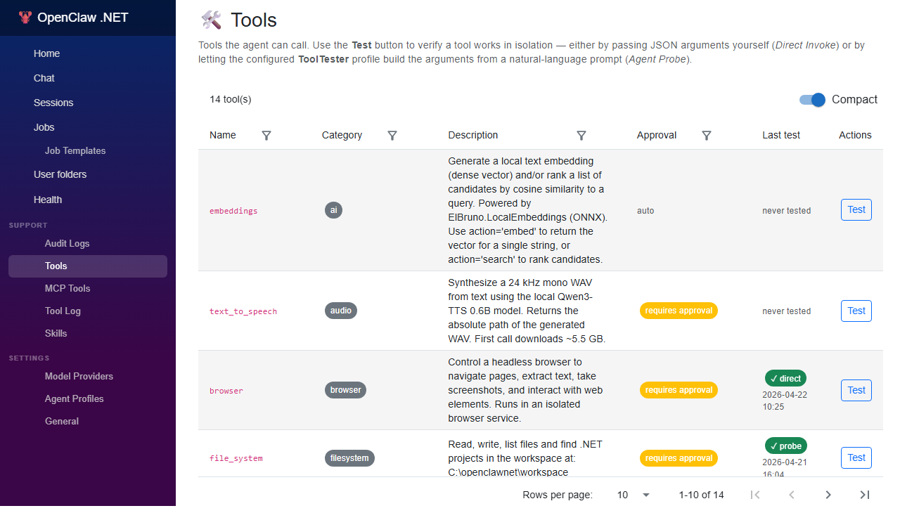
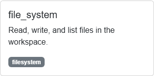
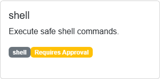
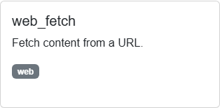
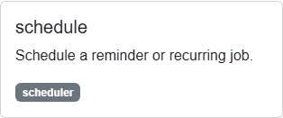

# Tools

OpenClaw .NET ships with a set of **first-class tools** the agent can invoke during a conversation. Each tool is a strongly-typed C# method exposed to the model through the Microsoft Agent Framework's function-calling protocol.

This guide covers the core tools you will use most often:

- **`file_system`** — read, write, and list workspace files
- **`shell`** — execute shell commands
- **`web_fetch`** — fetch URLs from the public web (raw bytes / HTML)
- **`markdown_convert`** — fetch a URL and return clean Markdown (powered by [ElBruno.MarkItDotNet](https://github.com/elbruno/ElBruno.MarkItDotNet))
- **`calculator`** — evaluate math/boolean expressions safely (powered by [NCalc](https://github.com/ncalc/ncalc))
- **`youtube_transcript`** — fetch a YouTube video's metadata and closed-caption transcript (powered by [YoutubeExplode](https://github.com/Tyrrrz/YoutubeExplode))
- **`text_to_image`** — generate a PNG from a text prompt with local Stable Diffusion 1.5 (powered by [ElBruno.Text2Image](https://github.com/elbruno/ElBruno.Text2Image))
- **`text_to_speech`** — synthesize a 24 kHz mono WAV from text using local Qwen3-TTS 0.6B (powered by [ElBruno.QwenTTS](https://github.com/elbruno/ElBruno.QwenTTS))
- **`embeddings`** — generate local text embeddings or rank candidates by cosine similarity (powered by [ElBruno.LocalEmbeddings](https://github.com/elbruno/ElBruno.LocalEmbeddings))
- **`github`** — read-only GitHub access for issues, pulls, commits, repos, and file contents (powered by [Octokit.NET](https://github.com/octokit/octokit.net))
- **`image_edit`** — resize, convert, and crop local images (powered by [SixLabors.ImageSharp](https://github.com/SixLabors/ImageSharp))
- **`html_query`** — fetch a URL and run a CSS selector against the parsed HTML (powered by [AngleSharp](https://github.com/AngleSharp/AngleSharp))
- **`schedule`** — create cron and one-shot jobs

See the full list of credits in [ACKNOWLEDGMENTS.md](../ACKNOWLEDGMENTS.md).

> **Prerequisite:** A running OpenClaw .NET instance (see **[01-local-installation.md](./01-local-installation.md)**).

---

## How Tools Are Invoked

You don't call tools directly. Instead, you describe what you want in natural language and the agent picks the right tool:

> **You:** *"List every `.cs` file under `src/OpenClawNet.Gateway` and show me the largest one."*
>
> **Agent:** invokes `file_system` (list) → invokes `file_system` (read) → returns the file content.

You can also **enable or disable** any tool from the **Settings → Tools** tab in the Web UI. Disabled tools disappear from the agent's tool list — even if you ask for them, the agent will refuse and explain that the tool is unavailable.



---

## `file_system`



Read, write, and enumerate files inside the agent's **workspace**.The workspace is a sandboxed directory; the tool refuses to traverse outside of it.

### Operations

| Operation | Description |
|-----------|-------------|
| `read` | Return the full contents of a file as text. |
| `write` | Create or overwrite a file. |
| `append` | Append text to an existing file. |
| `list` | List files and directories under a path. |
| `delete` | Delete a file. |
| `exists` | Check whether a path exists. |

### Parameters

| Parameter | Type | Required | Notes |
|-----------|------|----------|-------|
| `operation` | string | yes | One of the operations above. |
| `path` | string | yes | Workspace-relative path. |
| `content` | string | conditional | Required for `write` and `append`. |
| `encoding` | string | no | Defaults to `utf-8`. |

### Example prompts

> *"Create a file called `notes/today.md` with the heading `# Daily Standup`."*
>
> *"Read the contents of `AGENTS.md` and summarize what the agent is supposed to do."*
>
> *"List every Markdown file under `docs/manuals/` and tell me the total."*

### Safety

- All paths are resolved relative to the workspace root and cannot escape it (`..` traversal is blocked).
- Binary files are rejected by `read` — use the `shell` tool with `cat -b` or similar if you need raw bytes.

---

## `shell`



Run a shell command inside the workspace.The tool captures **stdout**, **stderr**, and the **exit code**, and returns them to the agent.

### Parameters

| Parameter | Type | Required | Notes |
|-----------|------|----------|-------|
| `command` | string | yes | The command to execute (e.g. `git status`). |
| `working_directory` | string | no | Workspace-relative; defaults to the workspace root. |
| `timeout_seconds` | integer | no | Default `60`. Maximum `600`. |
| `environment` | object | no | Extra environment variables for this run. |

### Example prompts

> *"Run `dotnet build` and tell me how many warnings there are."*
>
> *"Use git to show me the last five commits on this branch."*
>
> *"Run the unit tests in the `tests/OpenClawNet.UnitTests` directory and summarize the failures."*

### Behavior

- The tool uses **PowerShell** on Windows and **bash** on macOS/Linux.
- The command runs as the user account that started the AppHost.
- Output longer than ~16 KB is truncated and the agent is told.
- Non-zero exit codes are returned to the agent so it can react.

### Safety

The `shell` tool is **powerful**. Disable it under **Settings → Tools** for shared or production environments where you don't want the agent to run arbitrary commands.

---

## `web_fetch`



Download a URL and return the body as Markdown (default) or raw HTML.Useful for summarizing articles, pulling API docs, or letting the agent grab structured data.

### Parameters

| Parameter | Type | Required | Notes |
|-----------|------|----------|-------|
| `url` | string | yes | Must be `http://` or `https://`. |
| `format` | string | no | `markdown` (default) or `html`. |
| `max_length` | integer | no | Character cap for the response. Default `5000`, max `20000`. |
| `start_index` | integer | no | Pagination offset for large pages. |

### Example prompts

> *"Fetch `https://learn.microsoft.com/en-us/dotnet/aspire/fundamentals/setup-tooling` and list the supported install methods."*
>
> *"Grab the JSON from `https://api.github.com/repos/elbruno/openclawnet-plan` and tell me the star count."*

### Behavior

- Follows up to **5 redirects**.
- Times out after **30 seconds**.
- Strips scripts and styles when converting to Markdown.
- Respects `robots.txt` for `User-agent: OpenClawNet`.

### Limits

- Only **public URLs** are fetched. The tool refuses RFC1918 (private) addresses, `localhost`, and `127.0.0.1` to avoid exfiltrating data from internal services.
- Maximum response size is **2 MB** before truncation.

---

## `markdown_convert`

Fetches a URL and runs the response through the [ElBruno.MarkItDotNet](https://github.com/elbruno/ElBruno.MarkItDotNet) library to return clean Markdown — navigation, scripts, and styles stripped, page title preserved. Use this when you want the agent to *summarize* or *index* a web page rather than parse raw HTML token-by-token (which is what `web_fetch` returns).

| Argument | Type | Required | Notes |
| --- | --- | --- | --- |
| `url` | string | yes | Absolute http/https URL. Local/private addresses are blocked. |

The output is prefixed with `# Source: <url>` and `# Format: <ext>` lines so downstream prompts know the provenance and detected format. Content-Type drives the converter selection (`text/html → .html`, `application/pdf → .pdf`, `text/plain → .txt`, etc.); the URL extension is used as a fallback.

`RequiresApproval = false` — fetching a public URL is no more dangerous than `web_fetch`, and the conversion is read-only.

```text
You: Summarize the latest post on https://elbruno.com
Agent → markdown_convert(url="https://elbruno.com") → returns Markdown → summarizes
```

---

## `calculator`

Safe arithmetic and boolean expression evaluator powered by [NCalc](https://github.com/ncalc/ncalc) (the `NCalcSync` modern fork). Use this whenever a user question requires numeric reasoning — LLMs are notoriously unreliable at multi-step arithmetic and large-number operations.

| Argument | Type | Required | Notes |
| --- | --- | --- | --- |
| `expression` | string | yes | Any NCalc expression: `+ - * / % ^`, parentheses, comparisons, ternaries, `if(...)`, `in(...)`, plus `Math` functions like `Sqrt`, `Pow`, `Abs`, `Round`, `Sin`, `Cos`, `Min`, `Max`, `Log`, `Exp`. |

`RequiresApproval = false` — the evaluator is sandboxed (no function or parameter callbacks are wired up, so there is no code-execution surface).

```text
You: What is sqrt(2) * 3^4 + 5?
Agent → calculator(expression="Sqrt(2) * Pow(3,4) + 5") → "Sqrt(2) * Pow(3,4) + 5 = 119.56349186104046"
```

---

## `youtube_transcript`

Fetches a YouTube video's title, channel, duration, and (when available) its closed-caption transcript via [YoutubeExplode](https://github.com/Tyrrrz/YoutubeExplode). Pure HTTP — no API key required.

| Argument | Type | Required | Notes |
| --- | --- | --- | --- |
| `url` | string | yes | YouTube video URL or 11-character video ID. |
| `language` | string | no | Preferred caption language code (default `en`). Falls back to English then to the first available track. |

Output is a Markdown document: header (`# Title`), then `Channel`/`Duration`/`URL` lines, then a `## Transcript (<language>)` section with the captions one line per cue. If no closed captions are published the metadata is still returned.

```text
You: Summarize this talk: https://www.youtube.com/watch?v=...
Agent → youtube_transcript(url="...") → returns transcript → summarizes
```

---

## `text_to_image`

Generates a PNG image from a text prompt using a local Stable Diffusion 1.5 model via [ElBruno.Text2Image](https://github.com/elbruno/ElBruno.Text2Image) (CPU-only ONNX Runtime). Output is written under `<workspace>/.data/tool-outputs/text-to-image/<timestamp>.png` and the absolute path is returned in the tool result so the agent can reference or display it.

> ⚠️ **First-run model download:** the very first invocation downloads the SD 1.5 ONNX bundle (~4 GB) from HuggingFace into the local cache. Subsequent calls are fast.

| Argument | Type | Required | Notes |
| --- | --- | --- | --- |
| `prompt` | string | yes | Description of the image to generate. |
| `steps` | integer | no | Inference steps (default 15). More = higher quality, slower. |
| `seed` | integer | no | Optional seed for reproducible output. |
| `width` | integer | no | Image width in pixels (default 512). |
| `height` | integer | no | Image height in pixels (default 512). |

`RequiresApproval = true` — image generation is non-trivial work (CPU/RAM intensive, writes a file) so it is gated behind the standard tool-approval flow.

```text
You: Generate a logo idea for a podcast about avocado-flavoured AI
Agent → text_to_image(prompt="a friendly cartoon avocado wearing sunglasses, vector art")
       → "Saved to: C:\src\...\.data\tool-outputs\text-to-image\20251130-091245-123.png ..."
```

> The output directory is now configurable via the **Storage** settings (see below). When `Storage:RootPath` is set, files land under `<RootPath>/binary/text-to-image/`.

---

## `text_to_speech`

Synthesizes a 24 kHz mono WAV from text using the local **Qwen3-TTS 0.6B** model via [ElBruno.QwenTTS](https://github.com/elbruno/ElBruno.QwenTTS). The WAV is written under `<RootPath>/binary/text-to-speech/` and the absolute path is returned.

> ⚠️ **First-run model download:** ~5.5 GB into `<RootPath>/models/qwen-tts/`.

| Argument | Type | Required | Notes |
| --- | --- | --- | --- |
| `text` | string | yes | Text to synthesize. |
| `speaker` | string | no | One of `ryan` (default), `serena`, `vivian`, `aiden`, `eric`, `dylan`, `uncle_fu`, `ono_anna`, `sohee`. |
| `language` | string | no | One of `english` (default), `spanish`, `chinese`, `japanese`, `korean`. |

`RequiresApproval = true` — synthesis is heavy and produces a binary file.

---

## `embeddings`

Generates dense text embeddings locally and ranks candidates by cosine similarity. Powered by [ElBruno.LocalEmbeddings](https://github.com/elbruno/ElBruno.LocalEmbeddings) (ONNX Runtime + Microsoft.Extensions.AI). The default model (`sentence-transformers/all-MiniLM-L6-v2`) is downloaded on first use into `<RootPath>/models/embeddings/` (~90 MB).

| Argument | Type | Required | Notes |
| --- | --- | --- | --- |
| `action` | string | yes | `embed` (vector for one text) or `search` (rank `candidates` against `text`). |
| `text` | string | yes | Input text or query. |
| `candidates` | string[] | for `search` | Candidate strings to rank. |
| `topK` | integer | no | Top-K matches for `search` (default 5). |

Use it as the embedding backbone for lightweight RAG workflows or to find the most relevant snippet inside a corpus.

---

## `github`

Read-only GitHub access via [Octokit.NET](https://github.com/octokit/octokit.net). Anonymous calls are allowed but rate-limited; set the `GITHUB_TOKEN` secret (see **Secrets**, below) or environment variable to authenticate.

| Action | Required arguments |
| --- | --- |
| `list_issues` | `owner`, `repo` (+ optional `state`, `perPage`) |
| `list_pulls` | `owner`, `repo` (+ optional `state`, `perPage`) |
| `list_commits` | `owner`, `repo` (+ optional `perPage`) |
| `get_repo` | `owner`, `repo` |
| `get_file` | `owner`, `repo`, `path` |

```text
You: What issues are open in elbruno/openclawnet-plan?
Agent → github(action="list_issues", owner="elbruno", repo="openclawnet-plan")
```

---

## `image_edit`

Resize, convert, and crop local images via [SixLabors.ImageSharp](https://github.com/SixLabors/ImageSharp). Output PNG/JPEG/WebP files are written to `<RootPath>/binary/image-edit/`.

| Argument | Type | Required | Notes |
| --- | --- | --- | --- |
| `action` | string | yes | `resize`, `convert`, or `crop`. |
| `input` | string | yes | Absolute path to the input image. |
| `format` | string | no | `png` (default), `jpeg`, or `webp`. |
| `width`, `height` | integer | depends | Required for `resize` (at least one) and `crop`. |
| `x`, `y` | integer | no | Crop origin (default 0,0). |

---

## `html_query`

Fetch a URL, parse the response with [AngleSharp](https://github.com/AngleSharp/AngleSharp), and run a CSS selector. Use it for surgical HTML extraction (titles, meta tags, link lists) when full Markdown conversion is overkill.

| Argument | Type | Required | Notes |
| --- | --- | --- | --- |
| `url` | string | yes | Absolute http/https URL. Local/private addresses are rejected. |
| `selector` | string | yes | CSS selector, e.g. `h1`, `a.title`, `meta[name=description]`. |
| `attribute` | string | no | If set, returns the attribute value instead of the element text. |
| `limit` | integer | no | Maximum matches to return (default 10, max 100). |

```text
You: Get the H1 of elbruno.com
Agent → html_query(url="https://elbruno.com", selector="h1")
```

---

## Storage and Secrets

A few of the new tools share two pieces of infrastructure that you can configure once:

### `Storage`

A central root path for binary artifacts and model caches. Configure via standard ASP.NET Core configuration (env var, `appsettings.json`, or `OPENCLAWNET_Storage__RootPath`):

| Key | Default | Purpose |
| --- | --- | --- |
| `Storage:RootPath` | `C:\openclawnet\storage` (Windows) / `~/openclawnet/storage` | Root for tool outputs and downloaded models. |
| `Storage:BinaryFolderName` | `binary` | Subfolder for tool-generated artifacts. |
| `Storage:ModelsFolderName` | `models` | Subfolder for downloaded ONNX/model weights. |

Tools auto-create their per-tool subfolder, e.g. `<RootPath>/binary/text-to-image/`.

### Secrets

Tools read API keys from a centralized, encrypted secrets store (SQLite + ASP.NET DataProtection). Manage secrets via the Gateway HTTP API:

```http
GET    /api/secrets                 → list (no plaintext)
PUT    /api/secrets/{name}          → { "value": "...", "description": "..." }
DELETE /api/secrets/{name}
```

The `github` tool reads `GITHUB_TOKEN` from the secrets store first, then falls back to the environment variable of the same name.


## `schedule`



Create, list, and cancel jobs that run on a cron schedule or at a specific time.This is the agent-facing entry point to the **Scheduler service** documented in **[30-jobs.md](./30-jobs.md)**.

### Operations

| Operation | Description |
|-----------|-------------|
| `create_cron` | Schedule a recurring job from a cron expression. |
| `create_once` | Schedule a one-shot job at a specific UTC time. |
| `list` | List currently scheduled jobs. |
| `cancel` | Cancel a job by id. |
| `run_now` | Execute a scheduled job immediately. |

### Parameters

| Parameter | Type | Required for | Notes |
|-----------|------|--------------|-------|
| `operation` | string | all | See operations above. |
| `name` | string | `create_*` | Human-friendly job name. |
| `cron` | string | `create_cron` | Standard 5-field cron expression. |
| `run_at` | string | `create_once` | ISO-8601 UTC timestamp (e.g. `2026-04-20T15:00:00Z`). |
| `prompt` | string | `create_*` | The prompt to execute when the job runs. |
| `id` | string | `cancel`, `run_now` | The job id returned by `create_*` or `list`. |

### Example prompts

> *"Every weekday at 9 AM, send me a summary of yesterday's git commits."*
>
> *"In two hours, run a job that pulls the latest `gemma4:e2b` model from Ollama."*
>
> *"List my scheduled jobs and cancel the one called 'morning standup'."*

The agent generates the appropriate `cron` or `run_at` value from your natural-language request and calls `schedule.create_*` for you.

### Cron Quick Reference

| Expression | Meaning |
|------------|---------|
| `*/5 * * * *` | Every 5 minutes |
| `0 9 * * 1-5` | 09:00 every weekday |
| `0 0 * * 0` | Midnight every Sunday |
| `0 */2 * * *` | Every 2 hours, on the hour |

OpenClaw .NET uses **UTC** for cron evaluation. See **[30-jobs.md](./30-jobs.md)** for time-zone handling.

---

## Combining Tools

The agent often chains tools to satisfy a single request. For example:

> *"Find every TODO comment in `src/`, write a Markdown report to `notes/todos.md`, and schedule a recurring weekly review."*

The agent will:

1. Call `shell` → `grep -rn "TODO" src/`
2. Call `file_system` → `write` `notes/todos.md`
3. Call `schedule` → `create_cron` with `0 9 * * 1` and a prompt that re-runs steps 1–2.

You can ask for a plan up front (*"What tools will you use?"*) — the agent will describe the chain before executing it.

---

## Adding a New Tool

OpenClaw .NET uses the Microsoft Agent Framework. To add a tool:

1. Create a class library under `src/OpenClawNet.Tools.YourTool/`.
2. Reference `OpenClawNet.Tools.Abstractions`.
3. Implement a method decorated with `[KernelFunction]` and a clear `[Description]`.
4. Register the tool in `OpenClawNet.Gateway/Program.cs`.

The new tool appears in the **Settings → Tools** UI automatically. See `src/OpenClawNet.Tools.Scheduler/SchedulerTool.cs` for a reference implementation.


---

## Monitoring Tool Execution

Tool invocations are logged to the standard application logs. You can monitor tool calls in:

- **Application logs** — View via `dotnet run` console output or configured logging sinks
- **ILogger output** — Each tool execution logs start, completion, and duration at Information level

For detailed debugging of tool behavior, enable verbose logging in your `appsettings.json`:

```json
{
  "Logging": {
    "LogLevel": {
      "OpenClawNet.Tools": "Debug"
    }
  }
}
```

---

## Troubleshooting

### "Tool is not available"

Open **Settings → Tools** and confirm the tool's toggle is **on**.

### `shell` returns "command not found"

The command must exist on the host running the AppHost. For example, `dotnet` must be on `PATH`. Test from your terminal:

```bash
dotnet --version
```

### `web_fetch` blocks a URL

Private addresses (`localhost`, `10.x`, `192.168.x`, `172.16-31.x`) are refused by design. Use the `shell` tool with `curl` if you trust the target.

### `schedule` says "scheduler disabled"

Open **Settings → Scheduler** and toggle **Scheduler Enabled** on.

---

## Next Steps

- **[30-jobs.md](./30-jobs.md)** — Deep dive into the Scheduler and job lifecycle.
- **[10-settings.md](./10-settings.md)** — Toggle tools, tune the scheduler, switch providers.

---

## See Also

- [Components](../architecture/components.md)
- [Runtime Flow](../architecture/runtime-flow.md)
- [Tool Test Design](../design/tool-test-design.md) — design rationale for the Tool Test surface

---

## Testing a tool

Open **Tools** in the Web UI (`/tools`). Every registered tool is listed with its category, description, approval policy, and the result of the most recent test. Click **Test** to open the test dialog, which has two tabs: **Agent Probe** (the default) and **Direct Invoke**.

### Direct Invoke

No LLM is involved. The dialog renders one input per parameter from the tool's
JSON Schema — `string` fields become text inputs, `number`/`integer` become
numeric inputs, `boolean` becomes a `true`/`false` selector, and properties
with an `enum` become a dropdown of allowed values. Required parameters are
marked with a red asterisk and the schema's `description` shows as inline help
text.

If you'd rather work with raw JSON (or the tool exposes nested
objects/arrays), click **Show raw JSON** to switch to a free-form textarea —
the form values round-trip into the JSON view and back. Click **Defaults** to
fill every field with a sensible example value (drawn from the schema's
`default`/`examples` keywords when present, otherwise from a per-tool
heuristic — e.g. `browser` is pre-filled with `action=navigate`,
`url=https://elbruno.com`). Click **Run test** and
the gateway calls `ITool.ExecuteAsync` directly. Use this to:

- Verify a freshly-installed tool actually works.
- Reproduce a bug seen in chat with a precise input.
- Sanity-check a schema change before redeploying.

```json
{ "operation": "list", "path": "src/OpenClawNet.Gateway" }
```

### Agent Probe

The configured **ToolTester** profile (an `AgentProfile` whose `Kind = ToolTester`) receives the tool name, description, and parameter schema, plus your natural-language prompt. The model returns a JSON arguments object that the gateway then passes to the tool. Use this to:

- Verify the tool's schema is *interpretable* by an LLM — a common failure mode in chat.
- Diagnose why an agent keeps mis-calling a tool with the wrong arguments.
- Validate schema additions or renames without writing JSON by hand.

If no ToolTester profile exists, the **Agent Profiles** page shows a one-click suggestion banner that creates one pre-filled with sensible defaults (Azure OpenAI is recommended; approval prompts are disabled because every probe is an explicit user action).

The result is persisted in the `ToolTestRecords` table and shown as a status pill (✓ direct / ✗ probe / never tested) on the Tools page.
