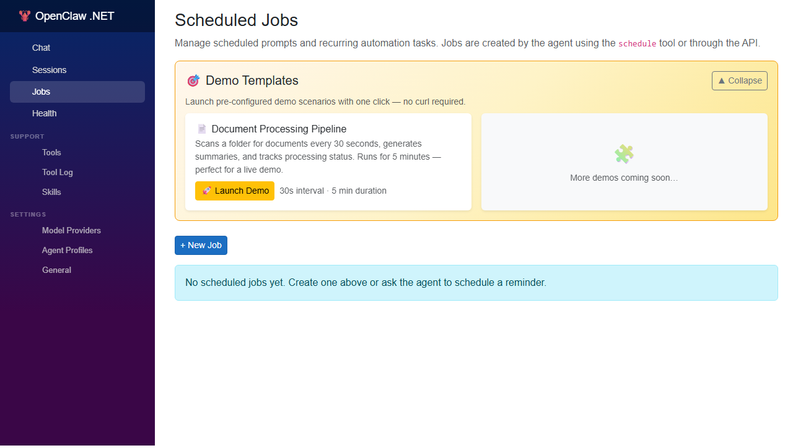
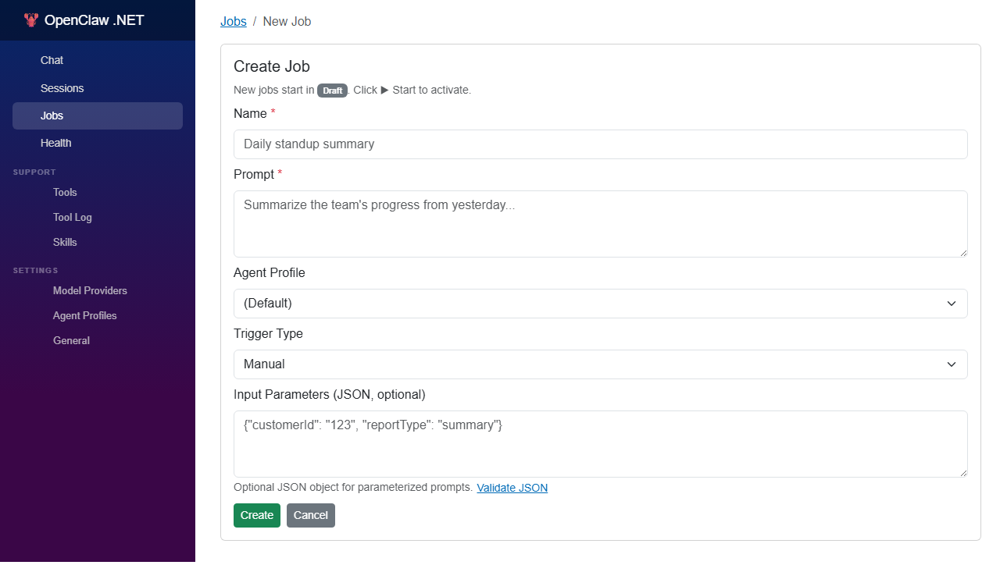
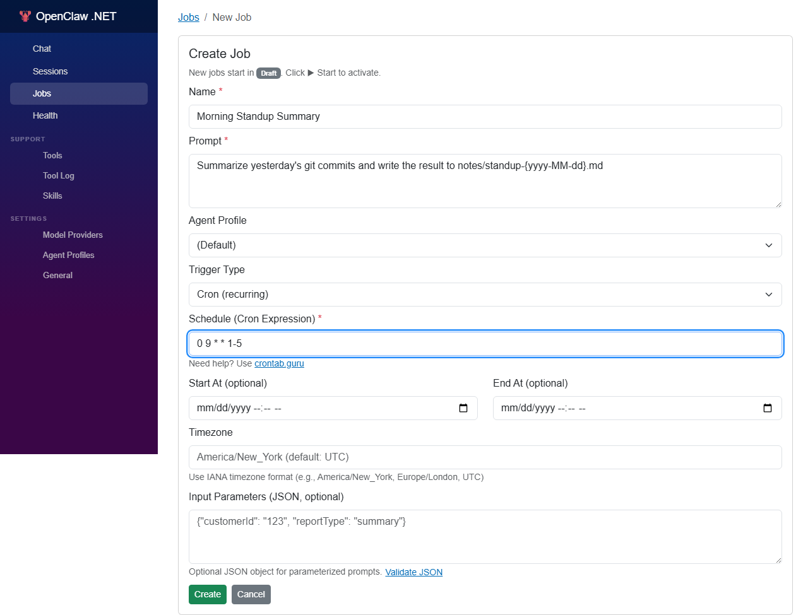
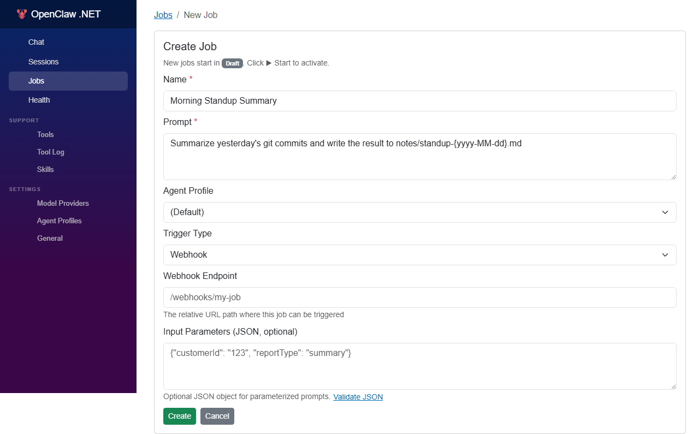

# Jobs

OpenClaw .NET includes a built-in **Scheduler** service that runs jobs on your behalf. Use jobs to automate recurring work (daily summaries, periodic data pulls, regular health checks) or to defer a single task to a later time.

This guide covers everything you need to create, schedule, monitor, and troubleshoot jobs.

> **Prerequisite:** A running OpenClaw .NET instance (see **[01-local-installation.md](./01-local-installation.md)**) with the **Scheduler** resource showing **Running** in the Aspire Dashboard.

---

## What Is a Job?

A **job** is a saved unit of work that the Scheduler executes when its trigger fires. Each job has:

| Field | Description |
|-------|-------------|
| **Id** | Auto-generated GUID. |
| **Name** | Human-friendly label. |
| **Trigger** | A cron expression **or** a one-shot UTC timestamp. |
| **Prompt** | The natural-language instruction the agent runs. |
| **Tools Allowed** | Optional whitelist of tools available during execution. |
| **Timeout** | Maximum runtime per execution (defaults to the global setting). |
| **Retry Policy** | Override for failed runs (`none`, `linear`, `exponential`). |
| **Status** | `enabled`, `paused`, `disabled`. |
| **History** | Per-run records (start, end, status, output). |

When a trigger fires, the Scheduler hands the prompt to the Gateway, which spins up an isolated agent run with the job's tool whitelist.

---

## Three Ways to Create a Job

### 1. From the Web UI



1. Open the Web UI and click **Jobs** in the left navigation.
2. Click **+ New Job**.


3. Fill out the form:
   - **Name** — e.g. `Morning Standup Summary`.
   - **Trigger** — choose **Cron** or **Run Once**.
   - **Schedule** — cron expression (`0 9 * * 1-5`) or date/time picker.
   - **Prompt** — what the agent should do.
   - **Tools** — leave all selected, or restrict to a subset.
4. Click **Save**. The job appears in the list immediately.

### 2. From the Chat (via the `schedule` tool)

Just ask:

> *"Every weekday at 9 AM, summarize yesterday's git commits in the `openclawnet-plan` repo and write the result to `notes/standup-{date}.md`."*

The agent recognizes the request, calls the `schedule.create_cron` tool, and confirms with the new job id. See **[20-tools.md](./20-tools.md#schedule)** for the tool's full parameter list.

### 3. From the REST API

The Gateway exposes a JSON API for programmatic job management:

```http
POST /api/jobs
Content-Type: application/json

{
  "name": "Morning Standup Summary",
  "trigger": {
    "type": "cron",
    "expression": "0 9 * * 1-5",
    "timezone": "UTC"
  },
  "prompt": "Summarize yesterday's git commits and write to notes/standup-{date}.md",
  "toolsAllowed": ["file_system", "shell"],
  "timeoutSeconds": 300
}
```

The response includes the new job's `id` and `nextRunAt`.

---

## Cron Expressions

The Scheduler uses standard **5-field POSIX cron**:

```
┌───────── minute        (0–59)
│ ┌─────── hour          (0–23)
│ │ ┌───── day of month  (1–31)
│ │ │ ┌─── month         (1–12)
│ │ │ │ ┌─ day of week   (0–6, Sunday = 0)
│ │ │ │ │
* * * * *
```

### Common Patterns

| Expression | Meaning |
|------------|---------|
| `*/5 * * * *` | Every 5 minutes |
| `0 * * * *` | Top of every hour |
| `0 9 * * *` | Every day at 09:00 |
| `0 9 * * 1-5` | Weekdays at 09:00 |
| `30 18 * * 5` | Every Friday at 18:30 |
| `0 0 1 * *` | Midnight on the 1st of each month |
| `0 */6 * * *` | Every 6 hours |
| `0 0 * * 0` | Midnight every Sunday |

### Time Zones

The Scheduler evaluates cron in **UTC by default**. To use a local time zone, set the `timezone` field on the trigger to a valid IANA name:

```json
{
  "trigger": {
    "type": "cron",
    "expression": "0 9 * * 1-5",
    "timezone": "America/New_York"
  }
}
```

> **Tip:** Stick to UTC unless you have a specific reason. It avoids daylight-saving surprises.

### Validating an Expression

In the Web UI's **New Job** form, type your cron expression — the next 5 firing times appear immediately under the field. If you see `Invalid expression`, fix the syntax before saving.



---

## One-Shot Jobs

The form also supports a **Webhook** trigger for jobs that fire only when an external system POSTs to their hook URL:



For a job that should run **exactly once**, choose **Run Once** and pick a UTC timestamp:

```json
{
  "name": "Pull latest model after maintenance",
  "trigger": {
    "type": "once",
    "runAt": "2026-04-20T15:00:00Z"
  },
  "prompt": "Run shell: ollama pull gemma4:e2b"
}
```

After execution the job moves to **completed** and is no longer triggered. Its history is retained per the **History Retention** setting.

---

## Executing a Job

You can also run a job on demand:

- **Web UI:** click the job, then click **Run Now**.
- **Chat:** *"Run my 'Morning Standup Summary' job now."*
- **API:** `POST /api/jobs/{id}/run`

Manual runs share the same execution path, history, and timeout as scheduled runs.

---

## Monitoring Job Runs

Every execution produces a **run record**:

| Field | Description |
|-------|-------------|
| `runId` | Unique id for the execution. |
| `jobId` | Parent job. |
| `startedAt` / `endedAt` | UTC timestamps. |
| `status` | `running`, `succeeded`, `failed`, `timed_out`, `cancelled`. |
| `output` | The agent's final response. |
| `error` | Stack trace or error message (when failed). |
| `toolCalls` | Per-step list of tool invocations and results. |

### Web UI

Open a job and switch to the **History** tab. You will see the most recent runs with status badges. Click a run to expand its tool-call timeline.

### Aspire Dashboard

Open the **scheduler** resource → **Logs** to follow live execution traces. Enable **Verbose Logging** in **Settings → Scheduler** for per-step detail.

### REST API

```http
GET /api/jobs/{id}/runs?limit=20
```

Returns the most recent runs for the job.

---

## Run Event Timeline (Persisted)

Every job run also persists an **append-only event timeline** to SQLite, so you can review what happened even after the app or Aspire stops. This is in addition to the OTEL traces (which are only live while Aspire is running).

Each row represents one step in the run:

| Field | Purpose |
|-------|---------|
| `sequence` | Monotonic 0-based order within the run. |
| `kind` | `agent_started`, `tool_call`, `agent_completed`, `agent_failed`, `profile_refused`. |
| `toolName` | Name of the tool (only for `tool_call`). |
| `argumentsJson` | The arguments the model passed to the tool, truncated at 4 KB. |
| `resultJson` | The tool's output (or error message if it failed), truncated at 4 KB. |
| `message` | Final response (success) or exception message (failure). |
| `durationMs`, `tokensUsed` | Per-step metrics where applicable. |

### REST API

```http
GET /api/jobs/{jobId}/runs/{runId}/events
```

Returns the ordered list of events for that run. `404` if the run does not belong to the job.

### Web UI

In the navigation sidebar, open **Jobs → Job Templates** to start from a template, or navigate directly to:

```
/jobs/{jobId}/runs/{runId}/events
```

…to see a colour-coded timeline with collapsible `args` / `result` sections per tool call.

### Retention notes

- Events live in the `JobRunEvents` table and **cascade-delete** when the parent `JobRun` is removed.
- Per-row payload is bounded (4 KB by default) — large tool results (image bytes, vector batches, file dumps) are truncated with a `...[truncated N chars]` suffix. Tools should prefer to return file paths / URLs rather than payloads where possible.
- There is currently no automatic per-job retention policy; if you need one, prune `JobRuns` periodically and the events go with them.

---

## Job Templates

Built-in **job templates** are read-only, pre-canned configurations distilled from the demos in [`docs/demos/tools/`](../demos/tools/README.md). They give you a one-click starting point with prompt + schedule + required tools + prerequisites.

### Web UI

Navigation sidebar → **Jobs → Job Templates**. You will see a card per template with:

- The required tools and secrets (badges).
- Collapsible prerequisites (folders, downloads, placeholders to edit).
- A prompt preview.
- A link back to the demo walkthrough.
- A **Use this template** button that creates the job using the template's defaults.

### REST API

```http
GET /api/jobs/templates              # list all templates
GET /api/jobs/templates/{id}         # get one template
```

The response shape:

```jsonc
{
  "id": "watched-folder-summarizer",
  "name": "Watched folder → Markdown → Summary",
  "description": "Every 5 minutes, scan a folder for documents...",
  "category": "files",
  "docsUrl": "https://github.com/.../01-watched-folder-summarizer/README.md",
  "prerequisites": ["The folder to watch exists (default c:\\temp\\sampleDocs).", "..."],
  "requiredSecrets": [],
  "requiredTools": ["file_system", "markdown_convert"],
  "defaultJob": {
    "name": "Watched folder summariser",
    "prompt": "List every file in c:\\temp\\sampleDocs ...",
    "cronExpression": "*/5 * * * *",
    "allowConcurrentRuns": false
  }
}
```

You can `POST` `defaultJob` directly to `/api/jobs` — it is already the shape `CreateJobRequest` expects.

### Built-in templates (today)

| Id | Demo |
|----|------|
| `watched-folder-summarizer` | [`01-watched-folder-summarizer`](../demos/tools/01-watched-folder-summarizer/README.md) |
| `github-issue-triage` | [`02-github-issue-triage`](../demos/tools/02-github-issue-triage/README.md) |
| `research-and-archive` | [`03-research-and-archive`](../demos/tools/03-research-and-archive/README.md) |
| `image-batch-resize` | [`04-image-batch-resize`](../demos/tools/04-image-batch-resize/README.md) |
| `text-to-speech-snippet` | [`05-text-to-speech-snippet`](../demos/tools/05-text-to-speech-snippet/README.md) |

> **Note:** Templates are immutable snapshots. Editing a template's JSON requires rebuilding the gateway. User-saveable templates are tracked as a future enhancement.

---

## Editing, Pausing, and Deleting

| Action | Web UI | Effect |
|--------|--------|--------|
| **Edit** | Click the job → **Edit** | Saves a new version; future runs use the new prompt/trigger. |
| **Pause** | Click the job → **Pause** | Trigger is preserved; no new runs fire. |
| **Resume** | Click the job → **Resume** | The trigger fires again on the next scheduled time. |
| **Run Now** | Click the job → **Run Now** | Executes immediately, regardless of pause state. |
| **Delete** | Click the job → **Delete** | Removes the job and its history. Cannot be undone. |

> **Tip:** Prefer **Pause** over **Delete** while debugging — you keep the run history.

---

## Retries and Failures

When a run fails (non-zero exit, exception, timeout), the Scheduler applies the job's **retry policy**:

| Policy | Behavior |
|--------|----------|
| `none` | Fail immediately, no retry. |
| `linear` | Retry every 60 seconds, up to **Max Retries**. |
| `exponential` | Retry after 30s, 60s, 120s, 240s, … capped at **Max Retries**. |

If the job still fails after all retries, the run is marked `failed` and surfaced in the Web UI with a red badge. Configure global defaults in **Settings → Scheduler** (see **[10-settings.md](./10-settings.md#scheduler-settings)**).

---

## Examples

### Daily Git Standup

```json
{
  "name": "Standup",
  "trigger": { "type": "cron", "expression": "0 9 * * 1-5" },
  "prompt": "Run `git log --since=yesterday --pretty=format:'%h %an %s'` in the workspace, summarize the changes by author, and write the result to `notes/standup-{yyyy-MM-dd}.md`.",
  "toolsAllowed": ["shell", "file_system"]
}
```

### Hourly Health Check

```json
{
  "name": "Ollama Health",
  "trigger": { "type": "cron", "expression": "0 * * * *" },
  "prompt": "Fetch http://localhost:11434/api/tags. If the response is not 200, write a row to `logs/ollama-health.csv` with the timestamp and status.",
  "toolsAllowed": ["web_fetch", "file_system"]
}
```

### One-Shot Cleanup at Midnight

```json
{
  "name": "Reset workspace",
  "trigger": { "type": "once", "runAt": "2026-04-21T00:00:00Z" },
  "prompt": "Delete every file under `notes/scratch/`.",
  "toolsAllowed": ["file_system", "shell"]
}
```

### Self-Scheduling Reminder

> **You:** *"Remind me in 30 minutes to check the build."*
>
> **Agent:** *"Scheduled — job id `j_8a7…` will run at 14:35 UTC and post a reminder."*

The agent picked `schedule.create_once`, computed `runAt`, and stored the prompt for you.

---

## Templates and Variables

Prompts may contain **variables** that the Scheduler resolves at run time:

| Variable | Replaced with |
|----------|---------------|
| `{date}` | UTC date `yyyy-MM-dd` |
| `{datetime}` | UTC date+time `yyyy-MM-ddTHH:mm:ssZ` |
| `{yyyy-MM-dd}` | Custom format string (any [.NET DateTime format](https://learn.microsoft.com/en-us/dotnet/standard/base-types/custom-date-and-time-format-strings)) |
| `{job.name}` | The job's name |
| `{job.id}` | The job's id |
| `{run.id}` | The current run id |

Example:

```text
Write the standup to notes/standup-{yyyy-MM-dd}.md
```

---

## Persistence

Jobs and run history live in the SQLite database (`src/OpenClawNet.AppHost/.data/openclawnet.db`):

| Table | Contents |
|-------|----------|
| `Jobs` | Job definition (name, trigger, prompt, tools, status). |
| `JobRuns` | Per-execution record (status, timing, output, error). |
| `JobToolCalls` | Per-tool-call detail captured during a run. |

Browse them via the **sqlite-web** resource in the Aspire Dashboard.

---

## Troubleshooting

### Jobs never run

1. Confirm the **scheduler** resource is **Running** in the Aspire Dashboard.
2. Open **Settings → Scheduler** and verify **Scheduler Enabled** is on.
3. Make sure the job is **enabled** (not paused).
4. Check the next-run preview in the Web UI — your cron may be further in the future than you think.

### Job runs but the agent says "tool is not available"

The job's **Tools Allowed** list excludes the tool, or the tool is globally disabled in **Settings → Tools**. Update the job, save, and rerun.

### Job times out

Increase the per-job **Timeout** or the global **Default Job Timeout** in **Settings → Scheduler**. Long-running shell commands or large web fetches are common culprits.

### Cron expression is silently rejected

Use exactly **5 fields**. The Scheduler does not support seconds (6-field) or year (7-field) extensions.

### History is missing older runs

Check **Settings → Scheduler → History Retention**. Older runs are pruned on a daily housekeeping pass.

### Time zone is off by an hour

Daylight-saving transitions can shift cron firing times. Switch the trigger to **UTC** or pin to a specific IANA zone (e.g. `Europe/Madrid`).

---

## Next Steps

- **[20-tools.md](./20-tools.md)** — Reference for the tools your jobs can call.
- **[10-settings.md](./10-settings.md)** — Tune retries, timeouts, and concurrency.

---

## See Also

- [Runtime Flow](../architecture/runtime-flow.md) — Job execution scenario.
- [Storage](../architecture/storage.md) — Job and run schema.
