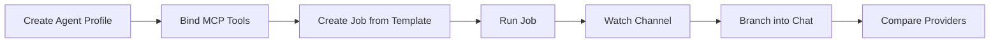

# Session 5 — End-to-end demo flow

> Spec source: [`docs/architecture/20260425-concept-review.md`](../../architecture/20260425-concept-review.md) §5 (Demo Storytelling).

This is the canonical "happy path" walkthrough we use when demoing OpenClawNet
end to end. It deliberately exercises every concept introduced in the April
2026 concept review so each piece is reachable from a single scripted demo.

## Scope

## Steps

1. **Create an agent profile.**
   Web → *Agent Profiles* → *New*. Pick a provider (Ollama for offline demo,
   Azure OpenAI for production-quality output). Save instructions describing
   the persona — these are appended to the workspace `AGENTS.md`.

2. **Bind MCP tools.**
   *Tools* → enable one or two MCP servers. At least one tool should require
   approval (so the approval card shows up live).

3. **Create a job from a template.**
   *Jobs* → *Templates* → pick a demo template → **Create & Activate**. The
   single button performs the atomic create-and-activate flow added in §4b.
   The job appears in *Active* state with its first state-change row already
   recorded.

4. **Run the job.**
   The runner produces artifacts. As each artifact is created, an event is
   pushed onto the in-memory channel bus and streamed to subscribers via
   `GET /api/channels/{jobId}/stream` (NDJSON, **not** SignalR — see
   [`channel-realtime.md`](../../demos/channel-realtime.md)).

5. **Watch the channel.**
   Open *Channels* → pick the job → live events arrive without polling.
   Polling remains as a fallback if the NDJSON stream is unavailable.

6. **Branch into chat.**
   Click *View in Channel* on the job detail page (deeplink added in §4c).
   From there, start a chat that targets the same agent profile. Both the
   job run and the chat turn write rows into `AgentInvocationLog` so the two
   are observable side by side.

7. **Compare providers.**
   Repeat step 6 against a different provider via the runtime model picker
   — see [`multi-provider-switch.md`](../../demos/multi-provider-switch.md).

## Friction points / known workarounds

| Friction | Workaround |
|---|---|
| First Ollama run is slow (model load) | Pre-warm with a single chat turn before the demo. |
| Approval card timer is short (60s default) | Keep the browser tab focused; or raise `ToolApproval:TimeoutSeconds`. |
| Channel NDJSON stream needs an open HTTP/1.1 connection | If a proxy buffers, fall back to refresh-based polling; behaviour unchanged. |
| Provider switch resets the active model | Expected — `RuntimeModelSettings.Load()` resets `Model` when `Provider` changes. |

## Related demos

- [Tool approval demo](../../demos/tool-approval-demo.md)
- [Multi-provider switch](../../demos/multi-provider-switch.md)
- [Channel real-time (NDJSON)](../../demos/channel-realtime.md)
